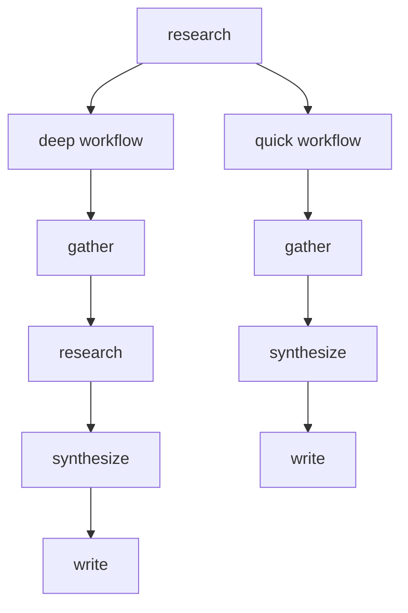

<!-- RFC 2119: MUST, MUST NOT, SHOULD, SHOULD NOT, MAY -->

# Convention: Diagrams (process.diagrams)

## Format Selection

1. Diagrams that are simple hierarchies or short sequences SHOULD use plain ASCII art.
2. Diagrams that involve branching, loops, or complex relationships SHOULD use Mermaid.
3. When a diagram is included in a markdown file rendered on GitHub, the author MUST verify it reads well in GitHub's narrow content column.

## ASCII Diagrams

4. ASCII diagrams MUST use box-drawing characters (`├`, `└`, `│`, `─`) or simple characters (`|`, `+`, `-`) for tree structures.
5. ASCII diagrams SHOULD be wrapped in a fenced code block (triple backticks) to preserve formatting.

## Mermaid Diagrams

<!-- GitHub's markdown content column is ~880px wide. Mermaid LR flowcharts
     with long node chains overflow horizontally or get compressed into
     unreadable thumbnails. TD/TB flows fit the tall-but-narrow viewport
     and remain legible without horizontal scrolling. -->
6. Mermaid flowcharts with more than 4 nodes in a single chain MUST use `TD` or `TB` direction, not `LR`.
7. `flowchart LR` MAY be used only when the diagram has 4 or fewer nodes in its longest chain.
8. Long node chains SHOULD be declared as separate edge statements rather than single-line chains (e.g., `A --> B` then `B --> C` instead of `A --> B --> C --> D --> E`).
9. Mermaid blocks MUST use the ` ```mermaid ` fenced code block syntax.
10. Node labels SHOULD use quoted strings (`A["label"]`) for readability.

## Placement

11. Diagrams SHOULD appear immediately after the concept they illustrate.
12. A plain ASCII version MAY accompany a Mermaid diagram as a fallback for contexts that do not render Mermaid (e.g., terminal, raw text).

## Golden Example

ASCII tree for a simple hierarchy:

```
Job ("research")
├── Steps: [gather, research, synthesize, write]
└── Workflows:
    ├── "deep"  → [gather, research, synthesize, write]
    └── "quick" → [gather, synthesize, write]
```

Mermaid flowchart for the same concept (rule 6: TD because >4 nodes; rule 8: separate edges):


