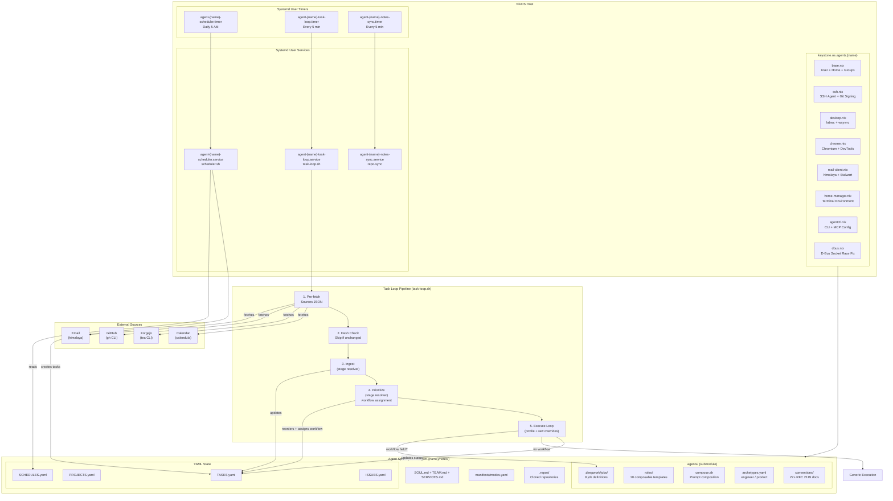
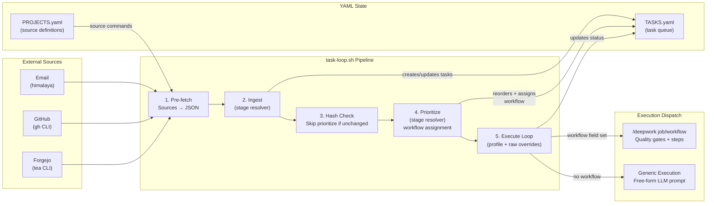

# OS Agents (`keystone.os.agents`)

OS agents are non-interactive NixOS user accounts designed for autonomous LLM-driven operation. Each agent gets an isolated home directory, SSH keys, mail, browser, and optional workspace cloning.

For how these OS-agent identities are exposed inside Claude Code, Gemini CLI,
Codex, and OpenCode as native custom agents, see
[Native CLI agents](native-cli-agents.md).

## Quick Start

```nix
keystone.os.agents.drago = {
  fullName = "Drago";
  email = "drago@example.com";
  ssh.publicKey = "ssh-ed25519 AAAAC3... agent-drago";
  notes.repo = "ssh://forgejo@git.example.com:2222/drago/notes.git";
};

# SSH public key is registered in the keys registry, not on the agent
keystone.keys."agent-atlas".hosts.myhost.publicKey = "ssh-ed25519 AAAAC3...";
```

## Architecture Overview



## Two-Agent Coordination

The system deploys two agents with complementary roles:

| Agent                       | Role                       | Responsibility                           | Runs On                      |
| --------------------------- | -------------------------- | ---------------------------------------- | ---------------------------- |
| **Product agent** (CPO)     | Business analysis, scoping | Press releases, milestones, user stories | VPS / headless server        |
| **Engineering agent** (CTO) | Implementation, delivery   | Code, PRs, deployments, code review      | Workstation with dev tooling |

### Artifact Handoff Chain

The agents collaborate through a structured artifact chain using GitHub/Forgejo as the shared coordination surface:

```
context → lean canvas → KPIs → market analysis → press release
  → milestone → user stories (issues) → branches → pull requests
```

1. **Product agent** produces a press release via `press_release/write` workflow
2. **Product agent** converts it to a milestone + issues via `product_engineering_handoff/handoff` workflow
3. **Engineering agent** picks up issues as task sources during ingest
4. **Engineering agent** creates branches, PRs, and delivers code via dedicated engineering workflows

Both agents share the same composable prompt architecture from the `.agents/` submodule (see [Shared Agents Library](#shared-agents-library)).

### Identity Documents

Each agent has:

- **SOUL.md** — Agent identity, name, email, accounts table
- **TEAM.md** — Full roster of humans and agents with roles and handles
- **SERVICES.md** — Intranet services (Git, Mail, Grafana, Vaultwarden)

## Agent Space (Workspace Cloning)

The `notes.repo` option clones a git repository into `/home/agent-{name}/notes/` on first boot.

### Forgejo SSH URL Format

When using Forgejo's built-in SSH server, the SSH username must match the system user running Forgejo — typically `forgejo`, **not** `git`.

```
# CORRECT — Forgejo built-in SSH server
ssh://forgejo@git.example.com:2222/owner/repo.git

# WRONG — will fail with "Permission denied (publickey)"
ssh://git@git.example.com:2222/owner/repo.git
git@git.example.com:owner/repo.git
```

The `git@` convention is GitHub/GitLab-specific. Forgejo's built-in SSH server (`START_SSH_SERVER = true`) runs as the `forgejo` user and only accepts connections with that username.

If using Forgejo with OpenSSH (passthrough mode) instead of the built-in server, `git@` may work depending on configuration — but the built-in server always requires `forgejo@`.

### SSH Authentication

The `agent-{name}-notes-sync` service uses the agent's SSH agent socket (`SSH_AUTH_SOCK`) for authentication. The agent's SSH key must be registered in the Forgejo user's SSH keys settings.

### Required Agenix Secrets

Each agent with SSH configured needs:

- `agent-{name}-ssh-key` — Private SSH key (ed25519)
- `agent-{name}-ssh-passphrase` — Passphrase for the key

### Sync Behavior

The notes-sync service runs `repo-sync`, which handles clone-if-absent on first run and fetch/commit/rebase/push on subsequent runs. Check status with:

```bash
systemctl --user status agent-{name}-notes-sync.service
journalctl --user -u agent-{name}-notes-sync -n 20
```

## What Each Agent Gets

| Feature        | Service/Config                     | Details                                      |
| -------------- | ---------------------------------- | -------------------------------------------- |
| User account   | `agent-{name}`                     | UID 4001+, group `agents`, no sudo           |
| Home directory | `/home/agent-{name}`               | chmod 750, readable by `agent-admins` group  |
| SSH agent      | `agent-{name}-ssh-agent.service`   | Auto-loads agenix key with passphrase        |
| Git signing    | `agent-{name}-git-config.service`  | SSH-based commit signing                     |
| Desktop        | `agent-{name}-labwc.service`       | Headless Wayland (labwc + wayvnc)            |
| Browser        | `agent-{name}-chromium.service`    | Chromium with remote debugging               |
| Mail           | himalaya CLI                       | Stalwart IMAP/SMTP via agenix password       |
| Calendar       | calendula CLI                      | Stalwart CalDAV (auto-configured from mail)  |
| Contacts       | cardamum CLI                       | Stalwart CardDAV (auto-configured from mail) |
| Bitwarden      | `bw` CLI                           | Configured for Vaultwarden instance          |
| Workspace      | `clone-agent-space-{name}.service` | Clones `notes.repo` on first boot            |

## Debugging

### Notes sync fails with "Permission denied (publickey)"

1. **Check the SSH username** in `notes.repo` — must be `forgejo@` for Forgejo's built-in SSH server
2. **Verify the key is registered** in Forgejo under the correct user's SSH keys
3. **Check the SSH agent is running** — notes-sync depends on `SSH_AUTH_SOCK`:
   ```bash
   agentctl {name} status agent-{name}-ssh-agent
   ```
4. **Test manually:**
   ```bash
   sudo runuser -u agent-{name} -- ssh -vvv \
     -o StrictHostKeyChecking=accept-new \
     -p 2222 -T forgejo@git.example.com
   ```
5. **Check key fingerprint matches:**

   ```bash
   # Fingerprint of the agenix private key
   ssh-keygen -lf /run/agenix/agent-{name}-ssh-key

   # Compare with the public key in your config
   echo "ssh-ed25519 AAAAC3..." | ssh-keygen -lf -
   ```

### Service dependency order

The notes-sync service requires:

- The agent's home directory (`agent-homes.service` or `zfs-agent-datasets.service` on ZFS)
- The agent's SSH agent (`agent-{name}-ssh-agent.service`) for authentication

The SSH agent service runs independently and is not a dependency of the clone service.

## Agent-Space Repository Structure

The agent-space is the agent's primary working directory (`/home/agent-{name}/notes/`). It can be provisioned in two modes:

- **Clone mode** (`notes.repo`): Clone an existing repository
- **Scaffold mode** (planned): Create a new agent-space with standard files

### Standard Directory Layout

```
/home/agent-{name}/notes/
├── CLAUDE.md                    # Symlink → AGENTS.md or generated by compose.sh
├── SOUL.md                      # Agent identity: name, email, accounts table
├── TEAM.md                      # Human + agent roster with roles and handles
├── SERVICES.md                  # Intranet services table (Service, URL)
├── HUMAN.md                     # Human operator: name, email
├── ISSUES.yaml                  # Known issues and incident log
├── PROJECTS.yaml                # Project priority list with source definitions
├── SCHEDULES.yaml               # Recurring task definitions
├── TASKS.yaml                   # Current task queue
├── .envrc                       # direnv: `use flake`
├── .mcp.json                    # MCP server configuration
├── flake.nix                    # Dev shell with required tools
├── flake.lock
│
├── .agents/                     # Git submodule → shared agents library
│   ├── conventions/             # 27+ RFC 2119 convention docs
│   ├── roles/                   # 10 composable role templates
│   ├── shared/                  # Reusable fragments (RFC 2119 preamble, output rules)
│   ├── archetypes.yaml          # engineer / product archetype definitions
│   ├── compose.sh               # Prompt composition: manifest + mode → assembled prompt
│   └── .deepwork/jobs/          # 9 DeepWork job definitions (shared across agents)
│
├── manifests/
│   └── modes.yaml               # Agent-specific mode → role + convention mapping
│
├── bin/                         # Agent-local scripts
│   ├── agent.coding-agent       # Coding subagent orchestrator (from Nix package)
│   ├── fetch-email-source       # Email-to-JSON bridge (from Nix package)
│   └── claude_tasks             # Manual task trigger wrapper
│
├── .repos/                      # Cloned repositories ({owner}/{repo})
│
├── .deepwork/                   # Symlink → .agents/.deepwork
│
├── .cronjobs/
│   ├── shared/
│   │   ├── lib.sh               # Shared functions (logging, locking)
│   │   ├── config.sh            # Environment variables and paths
│   │   └── setup.sh             # Installs units into ~/.config/systemd/user/
│   └── {job-name}/
│       ├── run.sh               # Job execution script
│       ├── service.unit         # Systemd service template
│       └── timer.unit           # Systemd timer template
│
└── .claude/
    └── settings.json            # Claude Code permissions allowlist
```

### Identity Documents

**SOUL.md** — Agent identity, auto-populated from NixOS config:

```markdown
# Soul

**Name:** Kumquat Drago
**Goes by:** Drago
**Email:** drago@example.com

## Accounts

| Service | Host            | Username | Auth Method       | Credentials              |
| ------- | --------------- | -------- | ----------------- | ------------------------ |
| GitHub  | github.com      | kdrgo    | OAuth device flow | `~/.config/gh/hosts.yml` |
| Forgejo | git.example.com | drago    | API token         | fj keyfile               |
```

**TEAM.md** — Full roster of humans and agents:

```markdown
# Team

## Humans

| Name            | Role | GitHub | Forgejo | Email                       |
| --------------- | ---- | ------ | ------- | --------------------------- |
| Nicholas Romero | CEO  | ncrmro | ncrmro  | nicholas.romero@example.com |

## Agents

| Name  | Role | GitHub      | Forgejo | Email             |
| ----- | ---- | ----------- | ------- | ----------------- |
| Luce  | CPO  | luce-ncrmro | luce    | luce@example.com  |
| Drago | CTO  | kdrgo       | drago   | drago@example.com |
```

**SERVICES.md** — Intranet services accessible via Tailscale:

```markdown
| Service     | URL                     |
| ----------- | ----------------------- |
| Git         | git.example.com         |
| Mail        | mail.example.com        |
| Grafana     | grafana.example.com     |
| Vaultwarden | vaultwarden.example.com |
```

**HUMAN.md** — Human operator info:

```markdown
# Human

**Name:** Nicholas Romero
**Email:** nicholas.romero@example.com
```

## Shared Agents Library (`.agents/` submodule)

Each agent-space includes the shared agents library as a git submodule at `.agents/`. This library provides the composable prompt architecture, DeepWork job definitions, and operational conventions shared across all agents.

### Components

| Component            | Path              | Purpose                                                                                                          |
| -------------------- | ----------------- | ---------------------------------------------------------------------------------------------------------------- |
| **Conventions**      | `conventions/`    | 27+ RFC 2119 operational docs (version control, CI, feature delivery, tool usage)                                |
| **Roles**            | `roles/`          | 10 composable role templates (architect, software-engineer, code-reviewer, business-analyst, project-lead, etc.) |
| **Shared fragments** | `shared/`         | Reusable prompt fragments (RFC 2119 preamble, output format rules)                                               |
| **Archetypes**       | `archetypes.yaml` | Pre-built convention bundles: `engineer` and `product`                                                           |
| **Composition tool** | `compose.sh`      | Assembles prompts from manifest + mode: shared → roles → conventions                                             |
| **DeepWork jobs**    | `.deepwork/jobs/` | 9 workflow definitions (task loop, daily status, research, etc.)                                                 |
| **Examples**         | `examples/`       | Reference agent-space layouts and manifest examples                                                              |

### Prompt Composition

Agents use `compose.sh` to assemble context-specific system prompts:

```bash
# Usage: compose.sh <manifest> <mode>
compose.sh manifests/modes.yaml implementation
```

**Composition order**: shared fragments → role templates → convention docs

Each agent-space has a `manifests/modes.yaml` that maps operational modes to roles and conventions:

```yaml
agents_repo: ../.agents
archetype: engineer # Inherits engineer conventions
defaults:
  shared:
    - rfc2119-preamble.md
    - output-format-rules.md
modes:
  implementation:
    roles: [software-engineer]
    conventions:
      [process.feature-delivery, process.pull-request, tool.nix-devshell]
  code-review:
    roles: [code-reviewer]
    conventions: [process.continuous-integration, process.version-control]
  architecture:
    roles: [architect]
    conventions: [process.feature-delivery]
```

### Archetypes

Archetypes are pre-built sets of conventions that apply to an agent role:

| Archetype  | Inlined Conventions                                                     | Purpose                  |
| ---------- | ----------------------------------------------------------------------- | ------------------------ |
| `engineer` | version-control, feature-delivery, continuous-integration, nix-devshell | Engineering agents (CTO) |
| `product`  | product-engineering-handoff, press-release                              | Product agents (CPO)     |

When a manifest declares `archetype: engineer`, the archetype's conventions are automatically included in every mode.

## Task Loop Architecture

The task loop is a Nix-packaged shell script (`task-loop.sh`) that runs as a systemd user service. It uses a two-timer pipeline for autonomous work orchestration.



### Task loop source discovery

The pre-fetch step is where an agent discovers new work from external systems.

Built-in sources include:

- email via `himalaya`,
- GitHub via `gh`,
- Forgejo via `tea`, and
- project-defined source commands from `PROJECTS.yaml`.

In practice, this is the bridge from platform activity to agent execution:

- assigned issues become candidate work,
- pull request and review activity becomes candidate work, and
- email requests become candidate work.

This is why issue-driven assignment works well for agentic feature delivery. If
you assign a press release issue or related planning issue to the right agent,
the next task-loop pre-fetch run can ingest it into `TASKS.yaml`.

For review-specific ownership and notification behavior, see
`process.code-review-ownership`, which defines notification-driven discovery via
the platform APIs and explicitly ties that discovery to task-loop pre-fetch.

### Timer Design

```
                    ┌─────────────────────────────────────────────────┐
                    │              Systemd User Timers                 │
                    │                                                 │
  5 AM daily ───▶   │  agent-{name}-scheduler.timer                   │
                    │    └── agent-{name}-scheduler.service            │
                    │        └── Creates tasks from SCHEDULES.yaml    │
                    │           + triggers task-loop                  │
                    │                                                 │
  Every 5 min ──▶   │  agent-{name}-task-loop.timer                   │
                    │    └── agent-{name}-task-loop.service            │
                    │        └── Runs task-loop.sh                    │
                    │                                                 │
  Every 5 min ──▶   │  agent-{name}-notes-sync.timer                  │
                    │    └── agent-{name}-notes-sync.service           │
                    │        └── repo-sync (git commit/push)          │
                    └─────────────────────────────────────────────────┘
```

Both `task-loop.sh` and `scheduler.sh` are shell scripts in `modules/os/agents/scripts/`, packaged via `pkgs.replaceVars` with Nix store paths for all dependencies. They run as the agent's systemd user services (defined in `notes.nix`).

### Pipeline Data Flow

```
task-loop.sh Pipeline:

1. PRE-FETCH             ──▶  PROJECTS.yaml sources → shell commands → JSON
                               + built-in: himalaya envelope list (email)
2. INGEST                ──▶  /deepwork task_loop ingest
                               Parse source JSON → update TASKS.yaml
                               Provider/model/profile resolved from ingest stage config
3. HASH CHECK            ──▶  SHA256(TASKS.yaml + PROJECTS.yaml) → skip if unchanged
4. PRIORITIZE            ──▶  /deepwork task_loop prioritize
                               Reorder TASKS.yaml by PROJECTS.yaml priority
                               Assign workflow via decision tree
                               Provider/model/profile resolved from prioritize stage config
5. EXECUTE LOOP          ──▶  For each pending task (max N per run):
   │                            ├── Check `needs` dependencies (yq+jq)
   │                            ├── Read task profile/provider/model/fallback_model/effort
   │                            ├── Resolve against execute stage + global defaults
   │                            ├── Invoke Claude, Gemini, or Codex
   │                            └── Log to ~/.local/state/agent-task-loop/logs/tasks/
   │
   └── Stop conditions: max tasks reached, no more pending tasks, already-attempted guard
```

### Scheduler

The scheduler (`scheduler.sh`) is a pure-bash script (no LLM) that runs once daily:

1. Reads `SCHEDULES.yaml` for recurring task definitions
2. Checks if each schedule is due today based on format:
   - `daily` — runs every day
   - `weekly:<day>` — runs on the named day (e.g., `weekly:monday`)
   - `monthly:<day>` — runs on the numbered day (e.g., `monthly:1`)
3. Creates tasks with `source: "schedule"` and `source_ref: "schedule-{name}-{YYYY-MM-DD}"` for deduplication
4. Sets the `workflow` field from the schedule definition (scheduler is the only creator that sets workflows at creation time)
5. Reads CalDAV calendar events via `calendula event list` (gracefully skipped if calendula is unavailable) — all events on the calendar become tasks, no prefix required
6. Creates tasks from calendar events with `source: "calendar"` and `source_ref: "calendar-{uid}-{YYYY-MM-DD}"` for deduplication
7. If any tasks were created, triggers `agent-{name}-task-loop.service`

### Workflow Dispatch

The execute step checks each task for a `workflow` field:

- **With workflow**: Invokes `/deepwork {job}/{workflow}` as the first line of the Claude prompt, engaging DeepWork quality gates and step-by-step execution
- **Without workflow**: Sends a generic "Execute this task" prompt — the LLM interprets the description freely

Available workflows that can be auto-assigned by the prioritize decision tree:

| Workflow              | Trigger                                               | Status                                     |
| --------------------- | ----------------------------------------------------- | ------------------------------------------ |
| `cadeng/cadeng`       | CAD keywords, hardware project                        | Planned (will be migrated to DeepWork job) |
| `press_release/write` | "press release" or "working backwards" in description | Exists                                     |

### Model control strategy

| Step       | Default profile | Default provider | Notes                                                                               |
| ---------- | --------------- | ---------------- | ----------------------------------------------------------------------------------- |
| Ingest     | `fast`          | `claude`         | Provider, model, fallback model, and effort come from the ingest-stage resolver     |
| Prioritize | `fast`          | `claude`         | Provider, model, fallback model, and effort come from the prioritize-stage resolver |
| Execute    | `medium`        | `claude`         | Task-level `profile` and raw overrides take precedence over execute-stage defaults  |

Built-in semantic profiles:

- `embedding` — reserved for later embedding/vector workflows; not intended for current task-loop chat stages
- `fast` — Claude `haiku` with `sonnet` fallback and `low` effort, Gemini `gemini-3-flash-preview`
- `medium` — Claude `sonnet` with `opus` fallback and `medium` effort, Gemini `auto-gemini-3`
- `max` — Claude `opus` with `max` effort, Gemini `auto-gemini-3`

Claude supports `model`, `fallback_model`, and `effort`. Gemini and Codex
currently consume `model` only; `fallback_model` and `effort` are ignored for
those providers until their CLIs support equivalent controls.

### Key Design Decisions

**task-loop.sh in Nix store**: The script is packaged via `pkgs.replaceVars` with Nix store paths for all dependencies (`yq`, `jq`, `coreutils`, etc.), ensuring reproducible execution. The `@placeholder@` pattern substitutes absolute paths at build time.

**Concurrency control**: `flock` prevents concurrent task-loop runs. The timer safely skips overlapping runs.

**Corruption guard**: After ingest and prioritize, the script validates TASKS.yaml with `yq` and reverts via `git checkout` if corrupted.

**YAML validation**: Both ingest and prioritize steps have DeepWork quality gates that verify schema compliance, deduplication, and field correctness.

## YAML Schema Reference

### TASKS.yaml

```yaml
tasks: # REQUIRED: only top-level key
  - name: "task-name" # REQUIRED: kebab-case identifier
    description: "What to do" # REQUIRED: human-readable
    status: pending # REQUIRED: pending|in_progress|completed|blocked
    project: "project-name" # MAY: from PROJECTS.yaml
    source: "email" # MAY: email|github-issue|github-pr|forgejo-issue|schedule|calendar|manual
    source_ref: "email-42-u@h" # MAY: unique ID for deduplication
    profile: "fast" # MAY: semantic profile override (embedding|fast|medium|max or custom)
    provider: "gemini" # MAY: claude|gemini|codex — task execution provider override
    model: "sonnet" # MAY: provider-specific model override
    fallback_model: "opus" # MAY: fallback model override (Claude only today)
    effort: "medium" # MAY: low|medium|high|max (Claude only today)
    workflow: "job/workflow" # MAY: DeepWork workflow to invoke
    needs: ["other-task"] # MAY: task names that must complete first
    blocked_reason: "..." # MAY: explanation when status is blocked
```

**Rules:**

1. Valid YAML, single top-level key `tasks` (a sequence)
2. NO other top-level keys (`summary:`, `metadata:`, etc.)
3. Every task MUST have `name`, `description`, `status`
4. Status MUST be one of: `pending`, `in_progress`, `completed`, `blocked`
5. Field names MUST match exactly — no `id`, `priority`, `urgency`, `depends_on`
6. Validate after every write: `yq e '.' TASKS.yaml`

**Source ref formats:**

- Email: `email-{id}-{sender_address}`
- GitHub issue: full URL
- Schedule: `schedule-{name}-{YYYY-MM-DD}`
- Calendar: `calendar-{uid}-{YYYY-MM-DD}`

**Workflow assignment rules:**

- Ingest MUST NOT set workflows — only appends new tasks with required fields
- Prioritize assigns workflows via a deterministic decision tree (first match wins)
- Scheduler sets workflows at task creation time from `SCHEDULES.yaml`
- Calendar events do not set workflows at creation — prioritize assigns them
- Pre-existing workflow fields are always preserved

**Execution fallback rules:**

- The resolver evaluates `provider`, `profile`, `model`, `fallback_model`, and `effort`
- Resolution order is: task fields → stage config (`ingest`, `prioritize`, or `execute`) → global `notes.taskLoop.defaults` → built-in stage/profile defaults
- `profile` selects provider-aware semantic defaults such as `fast`, `medium`, and `max`
- Raw task fields override profile-derived values
- `provider: claude` runs via Claude Code, `provider: gemini` runs via Gemini CLI, and `provider: codex` runs via `codex exec`
- `fallback_model` and `effort` currently apply to Claude only

**Configuration example:**

```nix
keystone.os.agents.researcher = {
  fullName = "Research Agent";
  notes.repo = "ssh://forgejo@git.example.com:2222/researcher/agent-space.git";
  notes.taskLoop = {
    defaults = {
      provider = "claude";
      profile = "medium";
    };
    ingest = {
      provider = "gemini";
      profile = "fast";
    };
    execute = {
      profile = "max";
      fallbackModel = "opus";
    };
    profiles.max = {
      claude = {
        model = "opus";
        effort = "max";
      };
      gemini.model = "auto-gemini-3";
    };
  };
};
```

With that config:

- ingest runs on Gemini with the `fast` profile
- prioritize falls back to Claude with the built-in `fast` profile
- execute falls back to Claude with the `max` profile unless the task overrides it

**Task override example:**

```yaml
tasks:
  - name: "review-agent-provider-docs"
    description: "Add docs for per-task providers and defaults."
    status: pending
    source: manual
    source_ref: "manual-review-agent-provider-docs"
    profile: "medium"
    provider: claude
    model: sonnet
    fallback_model: opus
    effort: high
```

That task overrides the stage and agent defaults and runs on Claude Code with
`sonnet`, `opus` as the fallback model, and `high` effort.

### PROJECTS.yaml

```yaml
projects:
  - name: "project-name" # REQUIRED: display name
    slug: "project-name" # REQUIRED: kebab-case
    description: "What it is" # REQUIRED: human-readable
    status: active # REQUIRED: active|archived
    priority: 1 # REQUIRED: numeric (list order = priority)
    updated: "2026-02-15" # REQUIRED: last updated date
    repos: # SHOULD mirror the hub note's remote URLs
      - "git@github.com:owner/repo-name.git"
      - "ssh://forgejo@git.example.com:2222/owner/infra.git"

sources: # Top-level: pre-fetch source definitions
  - name: "github-issues" # REQUIRED: identifier
    command: "gh issue list --json number,title,body --assignee @me" # REQUIRED: outputs JSON
```

Agent and human notes should use the same repo declarations. The active hub
note is the source of truth, `repos:` entries should be full remote URLs, and
non-keystone local worktrees should resolve to `$HOME/code/{owner}/{repo}`.
Repos explicitly managed by `keystone.repos` continue to live under
`~/.keystone/repos/{owner}/{repo}`.

### SCHEDULES.yaml

```yaml
schedules:
  - name: "daily-priorities" # REQUIRED: kebab-case identifier
    description: "..." # REQUIRED: human-readable
    schedule: "daily" # REQUIRED: daily | weekly:<day> | monthly:<day>
    workflow: "daily_status/send" # REQUIRED: DeepWork workflow to invoke
```

The scheduler creates tasks with `source: "schedule"` and `source_ref: "schedule-{name}-{YYYY-MM-DD}"` for deduplication.

### ISSUES.yaml

```yaml
issues:
  - name: "issue-name" # REQUIRED: kebab-case
    description: "What happened" # REQUIRED: detailed
    discovered_during: "task-name" # REQUIRED: which task surfaced this
    status: open # REQUIRED: open|mitigated|resolved
    severity: medium # MAY: low|medium|high|critical
    workaround: "..." # MAY: temporary mitigation
    fix: "..." # MAY: permanent resolution
```

## Cronjob Convention

Agents manage their own cronjobs via the `.cronjobs/` directory convention.

### Standard Layout

```
.cronjobs/
├── shared/
│   ├── lib.sh           # Logging, error handling, lock management
│   ├── config.sh        # AGENT_SPACE, LOG_DIR, etc.
│   └── setup.sh         # Installs all jobs via symlinks
└── {job-name}/
    ├── run.sh           # Execution script
    ├── service.unit     # systemd service unit
    └── timer.unit       # systemd timer unit
```

### run.sh Template

```bash
#!/usr/bin/env bash
set -euo pipefail

SCRIPT_DIR="$(cd "$(dirname "${BASH_SOURCE[0]}")" && pwd)"
source "$SCRIPT_DIR/../shared/lib.sh"
source "$SCRIPT_DIR/../shared/config.sh"

# Job logic here
log "Starting {job-name}"
# ...
log "Completed {job-name}"
```

**Critical rules:**

- Always use `SCRIPT_DIR` for relative paths, never hardcode absolute paths
- Always source `shared/lib.sh` for logging and error handling
- Capture subprocess exit codes explicitly: `OUTPUT=$(cmd); EXIT_CODE=$?` — do NOT pipe through `tee` (masks exit codes)

### Installation via setup.sh

The `setup.sh` script installs cronjobs by symlinking unit files into the user's systemd directory:

```bash
#!/usr/bin/env bash
SYSTEMD_DIR="$HOME/.config/systemd/user"
mkdir -p "$SYSTEMD_DIR"

for job_dir in "$SCRIPT_DIR"/*/; do
    job_name=$(basename "$job_dir")
    [[ "$job_name" == "shared" ]] && continue

    ln -sf "$job_dir/service.unit" "$SYSTEMD_DIR/${job_name}.service"
    ln -sf "$job_dir/timer.unit" "$SYSTEMD_DIR/${job_name}.timer"
done

systemctl --user daemon-reload
```

## DeepWork Job Convention

Each agent-space includes DeepWork job definitions via the `.agents/` submodule. Jobs are defined in `.deepwork/jobs/` and invoked through the `/deepwork` slash command during task execution.

### Available Jobs

| Job                           | Version | Agent   | Workflows                     | Purpose                                                                    |
| ----------------------------- | ------- | ------- | ----------------------------- | -------------------------------------------------------------------------- |
| `task_loop`                   | 3.3.1   | Both    | `ingest`, `prioritize`, `run` | Autonomous work orchestration — ingest sources, prioritize, execute        |
| `daily_status`                | 1.2.1   | Both    | `send`                        | Compile and send daily status digest email to human                        |
| `press_release`               | 1.0.0   | Product | `write`                       | Working-backwards press release to scope product features                  |
| `product_engineering_handoff` | 1.1.0   | Product | `handoff`                     | Convert press release → milestone + consolidated user stories issue        |
| `project_intake`              | 1.1.0   | Both    | `onboard`                     | Interactive onboarding for new projects (Lean Canvas, repo investigation)  |
| `research`                    | 1.1.0   | Both    | `research`                    | Structured research with platform selection and cited bibliography         |
| `agent_onboarding`            | 1.0.1   | Both    | `setup_all`                   | Bootstrap agent into environment: unlock vault, sign into services, verify |
| `agent_builder`               | 2.3.0   | Both    | `bootstrap`                   | Scaffold new agent-space repo (SOUL.md, manifest, submodule, task loop)    |
| `agent_convention`            | 1.1.0   | Both    | `create`                      | Create RFC 2119 convention docs and wire into mode manifests               |

### Job Directory Structure

```
.deepwork/jobs/{job_name}/
├── AGENTS.md          # Job-specific learnings and context
├── job.yml            # Job spec (name, version, workflows, steps)
├── steps/             # One .md file per step
│   └── shared/        # Shared reference docs
├── hooks/             # Custom validation hooks
├── scripts/           # Reusable helper scripts
├── templates/         # Example formats
├── outputs/           # Most recent step outputs
├── instances/         # Current run working directory
└── runs/              # Historical run artifacts
```

### Task Loop Job Workflows

The `task_loop` job (v3.3.1) has three workflows that map to the pipeline steps:

- **ingest** (`parse_sources` step): Parse pre-fetched JSON, compare with TASKS.yaml, create new tasks. Quality gates verify: no duplicates, required fields, project association, schema preservation, reply email parsing.
- **prioritize** (`reorder_tasks` step): Reorder pending tasks by project priority and assign `workflow` via decision tree. Quality gates verify: priority order, workflow assignment, and schema preservation.
- **run** (`execute` + `report` steps): Execute one task, update status, write JSON report. Quality gates verify: work actually performed, status updated, conventions followed.

### Planned Jobs (Not Yet DeepWork Definitions)

These workflows are referenced in the prioritize decision tree but do not yet have full DeepWork job definitions:

| Workflow        | Purpose                                                                 | Status                                                         |
| --------------- | ----------------------------------------------------------------------- | -------------------------------------------------------------- |
| `cadeng/cadeng` | CAD/hardware engineering (OpenSCAD, FreeCAD, 3D printing)               | Referenced in decision tree — will be migrated to DeepWork job |

## Coding Subagent Usage

The `agent.coding-agent` is a bash orchestrator that manages the full lifecycle of a code contribution.

### CLI Interface

```bash
agent.coding-agent \
  --repo OWNER/REPO \
  --task "description of the change" \
  [--branch PREFIX/NAME] \
  [--prefix feature|fix|chore|refactor|docs] \
  [--provider claude|codex|gemini] \
  [--model sonnet|opus] \
  [--max-review-cycles N] \
  [--review-only PR_NUMBER] \
  [--skip-review] \
  [--timeout SECONDS]
```

### Provider Contract

Provider scripts follow a positional argument interface:

```bash
agent.coding-agent.{provider} REPO_DIR SYSTEM_PROMPT_FILE TIMEOUT [--model MODEL]
```

Available providers:

- `agent.coding-agent.claude` — Uses Claude Code CLI with `--dangerously-skip-permissions`
- `agent.coding-agent.codex` — Stub (not yet implemented)
- `agent.coding-agent.gemini` — Stub (not yet implemented)

### Orchestrator/Subagent Split

The bash orchestrator handles all git and platform operations:

1. Pre-flight: verify repo exists in `.repos/`, detect remote type (GitHub/Forgejo), ensure clean state
2. Create branch: `{prefix}/{slugified-task}`
3. Generate system prompt with task context and 7 rules for the agent
4. Run provider: LLM creates commits within the working tree
5. Verify: count commits, check for BLOCKED.md
6. Push: GitHub uses token-based URL, Forgejo uses SSH
7. Create draft PR: `gh pr create --draft` (GitHub), `fj pr create "WIP: ..."` (Forgejo)

The LLM subagent only creates commits — it cannot push, create PRs, or switch branches.

### Review Cycle

After the initial PR, the orchestrator runs up to N review cycles (default 2):

1. Run provider with `sonnet` model and review prompt
2. Provider outputs structured format: `COMMENT: ...` followed by `VERDICT: PASS|FAIL`
3. Comments posted to the PR
4. On `FAIL` (not last cycle): re-run coding agent with fix prompt, push fixes
5. On `PASS`: mark PR ready (`gh pr ready` for GitHub, remove `WIP:` prefix for Forgejo)

## Terminal Environment Requirement

Agent systemd services (`task-loop`, `scheduler`, `notes-sync`) MUST have access to the full home-manager terminal environment. All tools available in an interactive agent shell MUST also be available in systemd service contexts.

### Design

The `notes.nix` module sets each service's PATH to the agent's full home-manager profile:

```
/etc/profiles/per-user/agent-{name}/bin:<nix>/bin:/run/current-system/sw/bin
```

Scripts (`task-loop.sh`, `scheduler.sh`) use bare commands (`yq`, `jq`, `bash`, `git`, `claude`, etc.) that resolve via this PATH. Only config values (`notesDir`, `maxTasks`, `agentName`) are substituted at build time via `pkgs.replaceVars` — tool paths are NOT individually resolved.

This matches the pattern used by `agentSvcHelper` in `lib.nix` and ensures that any tool available in an interactive shell is also available to agent services.

## Operational Conventions

### Email, Calendar, and Contacts

Agents have the full Pimalaya tool suite — himalaya (email), calendula (calendar), and cardamum (contacts). All auto-configured from the agent's mail credentials. See [Personal Information Management](personal-info-management.md) for usage details.

**Email (himalaya):**

- Always pipe email content via stdin, never use inline body arguments
- Use ASCII only — no unicode characters in email bodies
- Use `printf` with `\r\n` line endings (SMTP standard)
- Preview mode (`-p`) avoids marking messages as read

### Repository Cloning

All repositories are cloned to `.repos/{owner}/{repo}` within the agent-space:

```bash
git clone git@github.com:owner/repo.git .repos/owner/repo
```

### Nested Claude Sessions

When spawning a nested Claude session from within a Claude process, unset the tracking variable to avoid conflicts:

```bash
unset CLAUDECODE
claude --print -p "prompt here"
```

### Nix Dev Shell

All agent tools are managed via the `flake.nix` dev shell. Never install tools globally — use `nix develop --command <cmd>` or direnv integration.

### DeepWork Workflow Invocation

When invoking DeepWork workflows via Claude, the `/deepwork` slash command MUST be at the start of the `-p` string:

```bash
# CORRECT
claude --print -p "/deepwork task_loop run
Task: my-task
Description: do the thing"

# WRONG — model will freelance without quality gates
claude --print -p "Do the task. /deepwork task_loop run"
```

## Monitoring & Observability

Agents are monitored via **Loki** (for structured events and logs) and **Prometheus** (for real-time health and success metrics). A standard "Keystone OS Agents" dashboard is provisioned by the server-side Grafana module.

### Loki Telemetry (logfmt)

Agent scripts emit structured events using `logfmt`. Key fields available for querying and dashboard extraction:

| Field              | Description          | Example                                   |
| ------------------ | -------------------- | ----------------------------------------- |
| `event`            | Type of event        | `task_finish`, `run_start`, `stage_start` |
| `agent`            | Name of the agent    | `drago`                                   |
| `host`             | Hostname             | `ocean`                                   |
| `unit`             | Systemd unit name    | `agent-drago-task-loop`                   |
| `status`           | Outcome status       | `success`, `error`, `blocked`, `degraded` |
| `duration_seconds` | Execution time       | `42`                                      |
| `token_total`      | Total AI tokens used | `1250`                                    |
| `workflow`         | DeepWork workflow    | `project/implement`                       |
| `parsed_urls`      | URLs found in logs   | `["https://github.com/..."]`              |

### Prometheus Metrics

The `task-loop.sh` and `scheduler.sh` scripts write metrics to the standard node exporter textfile directory (`/var/lib/keystone-node-exporter-textfiles/`).

| Metric                                                    | Description                          |
| --------------------------------------------------------- | ------------------------------------ |
| `keystone_agent_task_loop_last_success_timestamp_seconds` | Last successful run time             |
| `keystone_agent_task_loop_last_exit_code`                 | Exit code of the most recent run     |
| `keystone_agent_task_loop_tasks_completed_total`          | Total tasks completed in last run    |
| `keystone_agent_task_loop_tasks_failed_total`             | Total tasks that errored in last run |
| `keystone_agent_task_loop_tasks_blocked_total`            | Total tasks blocked in last run      |

### Alerting Recommendations

1. **Agent Stalled**: Trigger if `time() - keystone_agent_task_loop_last_success_timestamp_seconds > 7200` (no success in 2 hours).
2. **Task Failure**: Trigger on any non-zero `keystone_agent_task_loop_last_exit_code`.
3. **Blocked Surge**: Trigger if `keystone_agent_task_loop_tasks_blocked_total > 5`.

## Implementation Status

### Implemented

| Feature               | Module/Script                       | Notes                                                                                              |
| --------------------- | ----------------------------------- | -------------------------------------------------------------------------------------------------- |
| Agent provisioning    | `modules/os/agents/` (8 submodules) | User, SSH, desktop, browser, mail, terminal, agentctl                                              |
| Task loop             | `scripts/task-loop.sh` (282 lines)  | Pre-fetch → ingest → prioritize → execute, flock concurrency                                       |
| Scheduler             | `scripts/scheduler.sh` (120 lines)  | SCHEDULES.yaml → pending tasks, pure bash                                                          |
| agentctl CLI          | `scripts/agentctl.sh` (391 lines)   | services, tasks, email, claude/gemini/codex, mail, vnc, provision                                  |
| Notes sync            | `notes.nix` + repo-sync package     | Timer-triggered git commit/push                                                                    |
| DeepWork jobs         | `.agents/.deepwork/jobs/` (9 jobs)  | task_loop, daily_status, research, press_release, handoff, intake, onboarding, builder, convention |
| Shared agents library | `.agents/` submodule                | 27+ conventions, 10 roles, compose.sh, archetypes                                                  |
| D-Bus socket fix      | `dbus.nix`                          | ConditionUser guard prevents race                                                                  |
| MCP config            | `agentctl.nix`                      | Generates `.mcp.json` per agent                                                                    |

### Partially Implemented

| Feature                         | Status              | What's Missing                                            |
| ------------------------------- | ------------------- | --------------------------------------------------------- |
| Mail provisioning (FR-004)      | himalaya works      | Stalwart account auto-provisioning not fully wired        |
| Bitwarden provisioning (FR-005) | rbw configured      | Per-agent Vaultwarden collection not created              |
| Tailscale per-agent (FR-006)    | Code exists         | Disabled due to agenix.service dependency                 |
| MCP config access (FR-015)      | .mcp.json generated | No `/etc/keystone/agent-mcp/{name}.json` for human access |

### Not Yet Implemented

| Feature                            | Description                                                      |
| ---------------------------------- | ---------------------------------------------------------------- |
| Agent-space scaffold mode (FR-009) | Auto-generate agent-space for new agents without existing repo   |
| Audit trail (FR-011)               | Immutable append-only log, Loki forwarding                       |
| Full security tests (FR-012)       | Basic VM test exists, full suite pending                         |
| Coding subagent in Nix (FR-013)    | Shell script exists but not Nix-packaged with provider interface |
| Incident log (FR-014)              | Shared incident database, auto-escalation                        |
| Cronjob Nix scaffold (FR-016)      | `.cronjobs/` convention documented but not auto-generated        |
| Agent-space flake (FR-017)         | `flake.nix` convention documented but not auto-generated         |
| cadeng DeepWork job                | Referenced in decision tree, not yet a job definition            |
