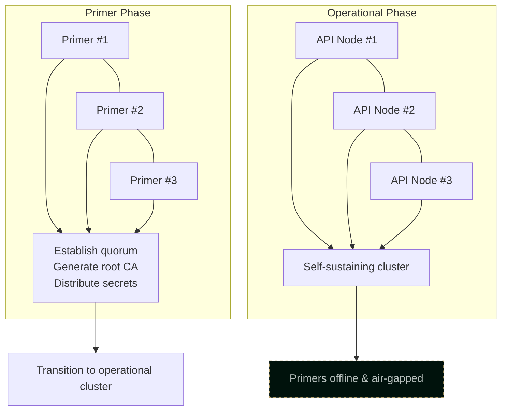

# Keystone Cluster Primer

Primer servers are bootstrap nodes that jumpstart Keystone hybrid cloud infrastructure. They establish initial trust, distribute secrets, and can safely go offline once the cluster reaches quorum.

## What is a Primer Server?

A primer server serves as the genesis node for a Keystone cluster. It:

- Generates initial cryptographic keys and certificates
- Establishes the root of trust
- Bootstraps the first cluster members
- Stores sensitive secrets in secure, offline-capable storage
- Can disconnect from the network after cluster stability is achieved

Think of it as the key that starts the engine—necessary for ignition, but not required for continued operation.

## Architecture Overview



## Primer Server Roles

### Identity Authority

The primer servers collectively form the initial Certificate Authority:

- Generate root CA keypair
- Issue initial node certificates
- Establish certificate chain for all cluster components

```
Root CA (generated on primers)
├── API Server Certificates
├── Node Certificates
├── Service Account Keys
└── Client Certificates
```

### Secrets Vault

Critical secrets are generated and stored on primer servers:

- Cluster CA private key
- Initial admin credentials
- Encryption keys for secrets management
- Backup recovery keys

These never leave the primer servers in plaintext.

### Bootstrap Coordinator

Primers orchestrate the initial cluster formation:

1. Establish consensus among primer nodes
2. Generate cluster identity
3. Initialize distributed state
4. Onboard first operational nodes
5. Transfer leadership to operational nodes

### Recovery Anchor

When disaster strikes, primers provide:

- Root key material for cluster recovery
- Backup decryption capability
- Trust chain reconstruction

## Setting Up Primer Servers

### Requirements

- Minimum 3 primers (odd number for quorum)
- Reliable hardware (doesn't need to be powerful)
- Secure physical location
- Optional: Hardware security module (HSM) support

### Initial Configuration

```nix
# primer-node.nix
{ config, pkgs, ... }: {
  services.keystone-primer = {
    enable = true;
    role = "primer";

    cluster = {
      name = "production";
      peers = [
        "primer-1.internal:6443"
        "primer-2.internal:6443"
        "primer-3.internal:6443"
      ];
    };

    security = {
      # Store keys on encrypted ZFS dataset
      keyStorage = "/secure/keys";

      # Minimum primers required for key operations
      quorumSize = 2;
    };

    bootstrap = {
      # Generate initial secrets on first run
      autoInitialize = true;

      # Backup encryption key (store separately!)
      backupKeyPath = "/secure/backup.key";
    };
  };

  # Encrypted storage for sensitive data
  fileSystems."/secure" = {
    device = "tank/secure";
    fsType = "zfs";
    options = [ "encryption=on" ];
  };
}
```

### Bootstrap Process

1. **Initialize First Primer**

   ```bash
   keystone-primer init --cluster production
   ```

2. **Join Additional Primers**

   ```bash
   keystone-primer join --token <bootstrap-token>
   ```

3. **Verify Quorum**

   ```bash
   keystone-primer status
   # Should show: Quorum: 3/3 primers healthy
   ```

4. **Generate Cluster Credentials**
   ```bash
   keystone-primer generate-credentials
   ```

## Private Key Management

### Key Hierarchy

```
Root Keys (never leave primers)
├── Cluster CA Key
│   └── Issues all cluster certificates
├── Encryption Master Key
│   └── Encrypts secrets at rest
└── Recovery Key
    └── Emergency cluster recovery
```

### Key Operations

All sensitive key operations require quorum:

```bash
# Requires 2 of 3 primers to participate
keystone-primer sign-certificate --csr node-4.csr

# Decrypt backup requires quorum
keystone-primer decrypt-backup --input cluster-backup.enc
```

### Key Rotation

Periodic rotation without primers coming online:

```bash
# Rotate subordinate keys (doesn't require primers)
keystone-cluster rotate-keys --type intermediate

# Rotate root keys (requires primer quorum)
keystone-primer rotate-root-keys
```

## Going Offline Safely

Once the cluster is self-sustaining, primers can go offline:

### Pre-Offline Checklist

1. **Verify Operational Quorum**

   ```bash
   keystone-cluster health
   # All API nodes healthy
   # Distributed state replicated
   ```

2. **Confirm Key Distribution**

   ```bash
   keystone-primer verify-handoff
   # Intermediate CAs issued
   # Renewal automation configured
   ```

3. **Test Recovery Path**
   ```bash
   # Verify you can bring primers back online if needed
   keystone-primer test-wake
   ```

### Offline Procedure

```bash
# Graceful shutdown
keystone-primer prepare-offline
shutdown -h now

# Physical security
# - Store in secure location
# - Consider air-gapped storage
# - Document physical location
```

### Maintenance Schedule

Even offline primers need periodic attention:

- **Quarterly**: Verify hardware health, check battery backup
- **Annually**: Test boot, verify key material integrity
- **On-Demand**: Respond to security advisories

## Recovery Scenarios

### Lost Operational Quorum

If operational nodes lose quorum:

1. Boot primer servers
2. Connect to network
3. Re-establish trust
4. Bootstrap new operational nodes

```bash
keystone-primer recover --mode quorum-restore
```

### Compromised Credentials

If cluster credentials are compromised:

1. Boot primer servers (quorum required)
2. Revoke compromised certificates
3. Issue new credentials
4. Update all nodes

```bash
keystone-primer emergency-rotate --all-credentials
```

### Complete Cluster Rebuild

For disaster recovery from backup:

1. Boot primer servers
2. Restore encrypted backup
3. Decrypt with quorum participation
4. Bootstrap fresh cluster

```bash
keystone-primer restore-cluster --backup cluster-2024-01-15.enc.zfs
```

## Security Considerations

### Physical Security

Offline primers should be:

- Stored in physically secure locations
- Distributed geographically
- Protected from environmental hazards
- Inventoried and tracked

### Access Control

- Limit who can access primer hardware
- Require multi-person authorization for key operations
- Audit all primer interactions

### Operational Security

- Never connect all primers simultaneously unless necessary
- Use dedicated, audited network for primer operations
- Consider hardware security modules for key storage

## Integration with NixOS

Primer configuration is fully declarative:

```nix
{ config, pkgs, ... }: {
  imports = [ ./keystone-primer.nix ];

  # ZFS for encrypted key storage
  boot.supportedFilesystems = [ "zfs" ];

  # Minimal services for security
  services.openssh.enable = true;
  services.openssh.settings.PermitRootLogin = "prohibit-password";

  # Firewall: only primer mesh and SSH
  networking.firewall.allowedTCPPorts = [ 22 6443 ];

  # Automatic security updates
  system.autoUpgrade.enable = true;
}
```

This ensures primers are reproducible and can be rebuilt from configuration if hardware fails.
