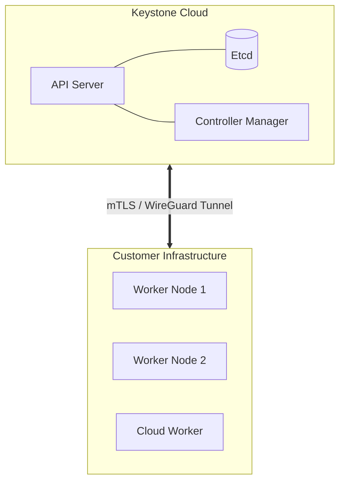

# Keystone Managed Services

Keystone Managed Services allows organizations to offload the complexity of running a high-availability Kubernetes control plane while retaining full sovereignty over their data and compute resources.

## The "Bring Your Own Workers" Model

Unlike traditional cloud providers where both the control plane and workers are hosted in the provider's data centers, Keystone uses a decoupled architecture:

1.  **Keystone Manages the Control Plane:** We host the API Servers, Etcd storage, Scheduler, and Controller Managers. We handle backups, upgrades, and security patching for these critical components.
2.  **You Manage the Data Plane:** Your worker nodes—where your actual applications and databases run—can reside anywhere:
    - On-premise bare metal servers
    - Edge locations / Branch offices
    - Public cloud accounts (AWS, GCP, Azure) owned by you

## Architecture

The connection between the Managed Control Plane and your worker nodes is secured via industry-standard protocols.

### Connectivity

We utilize transparent, secure tunneling (typically WireGuard) to establish a virtual private network between our control plane and your distributed worker nodes. This allows nodes behind NATs or firewalls to join the cluster seamlessly without complex port forwarding or VPN appliances.

## Benefits

### Reduced Operational Overhead

Running a production-grade Kubernetes control plane requires significant expertise (managing Etcd quorum, certificate rotation, API scaling). We handle this 24/7 so your team can focus on shipping applications.

### Data Sovereignty & Cost Control

Since the worker nodes run on your infrastructure, your data never leaves your control. You can utilize existing hardware investments or cheaper bare-metal providers, avoiding the premium markups of major cloud providers.

### Seamless Hybrid Cloud

A single control plane can manage workers across multiple environments. You can have a base load of on-prem workers for cost efficiency and "burst" into AWS/GCP instances during peak traffic—all managed as a single cluster.

## Security Model

- **Zero Trust:** All communication is mutually authenticated (mTLS) and encrypted.
- **Isolated Control Planes:** Every customer gets a dedicated control plane environment; no shared Etcd or API servers.
- **Audit Logging:** Full audit logs of all API interactions are shipped to your preferred logging destination.
