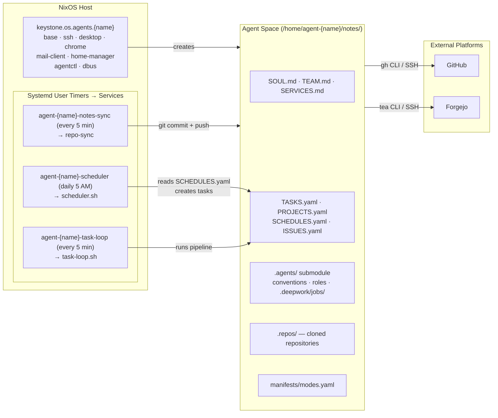
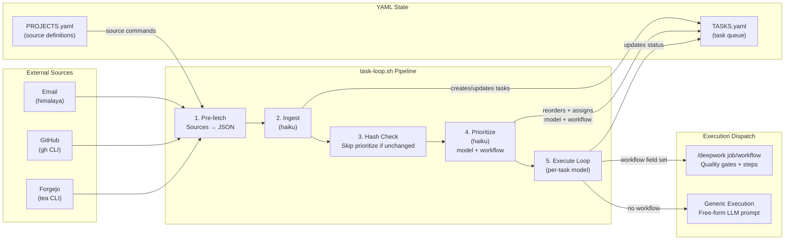
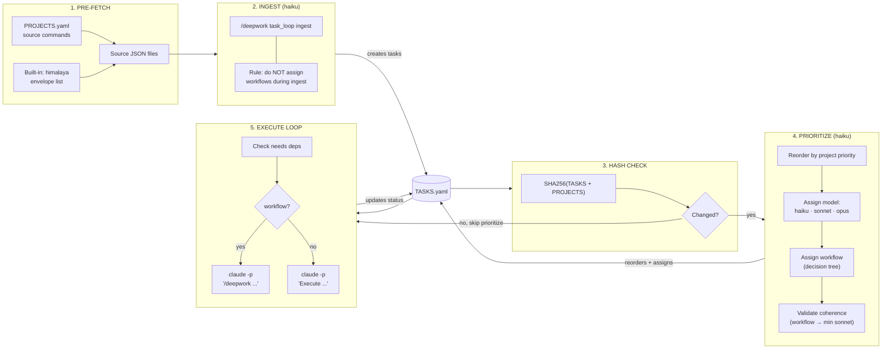

# OS Agents (`keystone.os.agents`)

OS agents are non-interactive NixOS user accounts designed for autonomous LLM-driven operation. Each agent gets an isolated home directory, SSH keys, mail, browser, and optional workspace cloning.

## Quick Start

```nix
keystone.os.agents.atlas = {
  fullName = "Atlas";
  email = "atlas@example.com";
  notes.repo = "ssh://forgejo@git.example.com:2222/atlas/notes.git";
};

# SSH public key is registered in the keys registry, not on the agent
keystone.keys."agent-atlas".hosts.myhost.publicKey = "ssh-ed25519 AAAAC3...";
```

## Architecture Overview



## Two-Agent Coordination

The system deploys two agents with complementary roles:

| Agent | Role | Responsibility |
|-------|------|---------------|
| **Product agent** (CPO) | Business analysis, scoping | Press releases, milestones, user stories |
| **Engineering agent** (CTO) | Implementation, delivery | Code, PRs, deployments, code review |

### Artifact Handoff Chain

The agents collaborate through a structured artifact chain using GitHub/Forgejo as the shared coordination surface:

```
context → lean canvas → KPIs → market analysis → press release
  → milestone → user stories (issues) → branches → pull requests
```

1. **Product agent** produces a press release via `press_release/write` workflow
2. **Product agent** converts it to a milestone + issues via `product_engineering_handoff/handoff` workflow
3. **Engineering agent** picks up issues as task sources during ingest
4. **Engineering agent** creates branches, PRs, and delivers code via `sweng/sweng` workflow

Both agents share the same composable prompt architecture from the `.agents/` submodule (see [Agent Space & Shared Library](os-agents.agent-space.md#shared-agents-library-agents-submodule)).

### Identity Documents

Each agent has:
- **SOUL.md** — Agent identity, name, email, accounts table
- **TEAM.md** — Full roster of humans and agents with roles and handles
- **SERVICES.md** — Intranet services (Git, Mail, Grafana, Vaultwarden)

## Agent Space (Workspace Cloning)

The `notes.repo` option clones a git repository into `/home/agent-{name}/notes/` on first boot.

### Forgejo SSH URL Format

When using Forgejo's built-in SSH server, the SSH username must match the system user running Forgejo — typically `forgejo`, **not** `git`.

```
# CORRECT — Forgejo built-in SSH server
ssh://forgejo@git.example.com:2222/owner/repo.git

# WRONG — will fail with "Permission denied (publickey)"
ssh://git@git.example.com:2222/owner/repo.git
git@git.example.com:owner/repo.git
```

The `git@` convention is GitHub/GitLab-specific. Forgejo's built-in SSH server (`START_SSH_SERVER = true`) runs as the `forgejo` user and only accepts connections with that username.

If using Forgejo with OpenSSH (passthrough mode) instead of the built-in server, `git@` may work depending on configuration — but the built-in server always requires `forgejo@`.

### SSH Authentication

The `agent-{name}-notes-sync` service uses the agent's SSH agent socket (`SSH_AUTH_SOCK`) for authentication. The agent's SSH key must be registered in the Forgejo user's SSH keys settings.

### Required Agenix Secrets

Each agent with SSH configured needs:
- `agent-{name}-ssh-key` — Private SSH key (ed25519)
- `agent-{name}-ssh-passphrase` — Passphrase for the key

### Sync Behavior

The notes-sync service runs `repo-sync`, which handles clone-if-absent on first run and fetch/commit/rebase/push on subsequent runs. Check status with:

```bash
systemctl --user status agent-{name}-notes-sync.service
journalctl --user -u agent-{name}-notes-sync -n 20
```

## What Each Agent Gets

| Feature | Service/Config | Details |
|---------|---------------|---------|
| User account | `agent-{name}` | UID 4001+, group `agents`, no sudo |
| Home directory | `/home/agent-{name}` | chmod 750, readable by `agent-admins` group |
| SSH agent | `agent-{name}-ssh-agent.service` | Auto-loads agenix key with passphrase |
| Git signing | `agent-{name}-git-config.service` | SSH-based commit signing |
| Desktop | `agent-{name}-labwc.service` | Headless Wayland (labwc + wayvnc) |
| Browser | `agent-{name}-chromium.service` | Chromium with remote debugging |
| Mail | himalaya CLI | Stalwart IMAP/SMTP via agenix password |
| Calendar | calendula CLI | Stalwart CalDAV (auto-configured from mail) |
| Contacts | cardamum CLI | Stalwart CardDAV (auto-configured from mail) |
| Bitwarden | `bw` CLI | Configured for Vaultwarden instance |
| Workspace | `agent-{name}-notes-sync.service` | Clones `notes.repo` on first run, syncs on timer |

## Debugging

### Notes sync fails with "Permission denied (publickey)"

1. **Check the SSH username** in `notes.repo` — must be `forgejo@` for Forgejo's built-in SSH server
2. **Verify the key is registered** in Forgejo under the correct user's SSH keys
3. **Check the SSH agent is running** — notes-sync depends on `SSH_AUTH_SOCK`:
   ```bash
   agentctl {name} status agent-{name}-ssh-agent
   ```
4. **Test manually:**
   ```bash
   sudo runuser -u agent-{name} -- ssh -vvv \
     -o StrictHostKeyChecking=accept-new \
     -p 2222 -T forgejo@git.example.com
   ```
5. **Check key fingerprint matches:**
   ```bash
   # Fingerprint of the agenix private key
   ssh-keygen -lf /run/agenix/agent-{name}-ssh-key

   # Compare with the public key in your config
   echo "ssh-ed25519 AAAAC3..." | ssh-keygen -lf -
   ```

### Service dependency order

The notes-sync service requires:
- The agent's home directory (`agent-homes.service` or `zfs-agent-datasets.service` on ZFS)
- The agent's SSH agent (`agent-{name}-ssh-agent.service`) for authentication

See [Agent Space & Shared Library](os-agents.agent-space.md) for the agent-space repository structure, identity documents, shared agents library, prompt composition, and archetypes.

## Task Loop Architecture

The task loop is a Nix-packaged shell script (`task-loop.sh`) that runs as a systemd user service, supported by three timers for autonomous work orchestration.



### Timer Design

```
                    ┌─────────────────────────────────────────────────┐
                    │              Systemd User Timers                 │
                    │                                                 │
  5 AM daily ───▶   │  agent-{name}-scheduler.timer                   │
                    │    └── agent-{name}-scheduler.service            │
                    │        └── Creates tasks from SCHEDULES.yaml    │
                    │           + triggers task-loop                  │
                    │                                                 │
  Every 5 min ──▶   │  agent-{name}-task-loop.timer                   │
                    │    └── agent-{name}-task-loop.service            │
                    │        └── Runs task-loop.sh                    │
                    │                                                 │
  Every 5 min ──▶   │  agent-{name}-notes-sync.timer                  │
                    │    └── agent-{name}-notes-sync.service           │
                    │        └── repo-sync (git commit/push)          │
                    └─────────────────────────────────────────────────┘
```

Both `task-loop.sh` and `scheduler.sh` are shell scripts in `modules/os/agents/scripts/`, packaged via `pkgs.replaceVars` with Nix store paths for all dependencies. They run as the agent's systemd user services (defined in `notes.nix`).

### Pipeline Data Flow



### Scheduler

The scheduler (`scheduler.sh`) is a pure-bash script (no LLM) that runs once daily:

1. Reads `SCHEDULES.yaml` for recurring task definitions
2. Checks if each schedule is due today based on format:
   - `daily` — runs every day
   - `weekly:<day>` — runs on the named day (e.g., `weekly:monday`)
   - `monthly:<day>` — runs on the numbered day (e.g., `monthly:1`)
3. Creates tasks with `source: "schedule"` and `source_ref: "schedule-{name}-{YYYY-MM-DD}"` for deduplication
4. Sets the `workflow` field from the schedule definition (scheduler is the only creator that sets workflows at creation time)
5. If any tasks were created, triggers `agent-{name}-task-loop.service`

### Workflow Dispatch

The execute step checks each task for a `workflow` field:

- **With workflow**: Invokes `/deepwork {job}/{workflow}` as the first line of the Claude prompt, engaging DeepWork quality gates and step-by-step execution
- **Without workflow**: Sends a generic "Execute this task" prompt — the LLM interprets the description freely

Available workflows that can be auto-assigned by the prioritize decision tree:

| Workflow | Trigger | Status |
|----------|---------|--------|
| `sweng/sweng` | Code-related issues/PRs, repos with code keywords | Planned (will be migrated to DeepWork job) |
| `cadeng/cadeng` | CAD keywords, hardware project | Planned (will be migrated to DeepWork job) |
| `press_release/write` | "press release" or "working backwards" in description | Exists |

### Model Separation Strategy

| Step | Default Model | Rationale |
|------|--------------|-----------|
| Ingest | haiku | Fast parsing, no reasoning needed |
| Prioritize | haiku | Simple reordering and classification, cost-efficient |
| Execute | per-task (sonnet default) | Reasoning-heavy, model matches task complexity |

The prioritize step assigns models based on task complexity:
- **haiku** — Simple mechanical tasks (reply pong, forward message, single-command)
- **sonnet** — Standard multi-step work (research, coding, email composition, tool chaining)
- **opus** — Advanced tasks (complex architecture, multi-system debugging, novel problem-solving)

**Model-workflow coherence**: Any task with a `workflow` field MUST have at least `sonnet` as its model. If prioritize assigns `haiku` but also assigns a workflow, the model is upgraded to `sonnet`.

### Key Design Decisions

**task-loop.sh in Nix store**: The script is packaged via `pkgs.replaceVars` with Nix store paths for all dependencies (`yq`, `jq`, `coreutils`, etc.), ensuring reproducible execution. The `@placeholder@` pattern substitutes absolute paths at build time.

**Concurrency control**: `flock` prevents concurrent task-loop runs. The timer safely skips overlapping runs.

**Corruption guard**: After ingest and prioritize, the script validates TASKS.yaml with `yq` and reverts via `git checkout` if corrupted.

**YAML validation**: Both ingest and prioritize steps have DeepWork quality gates that verify schema compliance, deduplication, and field correctness.

## YAML Schema Reference

### TASKS.yaml

```yaml
tasks:                             # REQUIRED: only top-level key
  - name: "task-name"              # REQUIRED: kebab-case identifier
    description: "What to do"      # REQUIRED: human-readable
    status: pending                # REQUIRED: pending|in_progress|completed|blocked
    project: "project-name"       # MAY: from PROJECTS.yaml
    source: "email"               # MAY: email|github-issue|github-pr|forgejo-issue|schedule|manual
    source_ref: "email-42-u@h"    # MAY: unique ID for deduplication
    model: "sonnet"               # MAY: haiku|sonnet|opus — execution model override
    workflow: "job/workflow"       # MAY: DeepWork workflow to invoke
    needs: ["other-task"]         # MAY: task names that must complete first
    blocked_reason: "..."         # MAY: explanation when status is blocked
```

**Rules:**
1. Valid YAML, single top-level key `tasks` (a sequence)
2. NO other top-level keys (`summary:`, `metadata:`, etc.)
3. Every task MUST have `name`, `description`, `status`
4. Status MUST be one of: `pending`, `in_progress`, `completed`, `blocked`
5. Field names MUST match exactly — no `id`, `priority`, `urgency`, `effort`, `depends_on`
6. Validate after every write: `yq e '.' TASKS.yaml`

**Source ref formats:**
- Email: `email-{id}-{sender_address}`
- GitHub issue: full URL
- Schedule: `schedule-{name}-{YYYY-MM-DD}`

**Workflow assignment rules:**
- Ingest MUST NOT set workflows — only appends new tasks with required fields
- Prioritize assigns workflows via a deterministic decision tree (first match wins)
- Scheduler sets workflows at task creation time from `SCHEDULES.yaml`
- Pre-existing workflow fields are always preserved

### PROJECTS.yaml

```yaml
projects:
  - name: "project-name"          # REQUIRED: display name
    slug: "project-name"          # REQUIRED: kebab-case
    description: "What it is"     # REQUIRED: human-readable
    status: active                # REQUIRED: active|archived
    priority: 1                   # REQUIRED: numeric (list order = priority)
    updated: "2026-02-15"         # REQUIRED: last updated date
    repos:                        # MAY: associated repositories
      - "owner/repo-name"

sources:                           # Top-level: pre-fetch source definitions
  - name: "github-issues"         # REQUIRED: identifier
    command: "gh issue list --json number,title,body --assignee @me"  # REQUIRED: outputs JSON
```

### SCHEDULES.yaml

```yaml
schedules:
  - name: "daily-priorities"      # REQUIRED: kebab-case identifier
    description: "..."            # REQUIRED: human-readable
    schedule: "daily"             # REQUIRED: daily | weekly:<day> | monthly:<day>
    workflow: "daily_status/send" # REQUIRED: DeepWork workflow to invoke
```

The scheduler creates tasks with `source: "schedule"` and `source_ref: "schedule-{name}-{YYYY-MM-DD}"` for deduplication.

### ISSUES.yaml

```yaml
issues:
  - name: "issue-name"            # REQUIRED: kebab-case
    description: "What happened"   # REQUIRED: detailed
    discovered_during: "task-name" # REQUIRED: which task surfaced this
    status: open                   # REQUIRED: open|mitigated|resolved
    severity: medium               # MAY: low|medium|high|critical
    workaround: "..."             # MAY: temporary mitigation
    fix: "..."                    # MAY: permanent resolution
```

## Cronjob Convention

Agents manage their own cronjobs via the `.cronjobs/` directory convention.

### Standard Layout

```
.cronjobs/
├── shared/
│   ├── lib.sh           # Logging, error handling, lock management
│   ├── config.sh        # AGENT_SPACE, LOG_DIR, etc.
│   └── setup.sh         # Installs all jobs via symlinks
└── {job-name}/
    ├── run.sh           # Execution script
    ├── service.unit     # systemd service unit
    └── timer.unit       # systemd timer unit
```

### run.sh Template

```bash
#!/usr/bin/env bash
set -euo pipefail

SCRIPT_DIR="$(cd "$(dirname "${BASH_SOURCE[0]}")" && pwd)"
source "$SCRIPT_DIR/../shared/lib.sh"
source "$SCRIPT_DIR/../shared/config.sh"

# Job logic here
log "Starting {job-name}"
# ...
log "Completed {job-name}"
```

**Critical rules:**
- Always use `SCRIPT_DIR` for relative paths, never hardcode absolute paths
- Always source `shared/lib.sh` for logging and error handling
- Capture subprocess exit codes explicitly: `OUTPUT=$(cmd); EXIT_CODE=$?` — do NOT pipe through `tee` (masks exit codes)

### Installation via setup.sh

The `setup.sh` script installs cronjobs by symlinking unit files into the user's systemd directory:

```bash
#!/usr/bin/env bash
SYSTEMD_DIR="$HOME/.config/systemd/user"
mkdir -p "$SYSTEMD_DIR"

for job_dir in "$SCRIPT_DIR"/*/; do
    job_name=$(basename "$job_dir")
    [[ "$job_name" == "shared" ]] && continue

    ln -sf "$job_dir/service.unit" "$SYSTEMD_DIR/${job_name}.service"
    ln -sf "$job_dir/timer.unit" "$SYSTEMD_DIR/${job_name}.timer"
done

systemctl --user daemon-reload
```

## DeepWork Job Convention

Each agent-space includes DeepWork job definitions via the `.agents/` submodule. Jobs are defined in `.deepwork/jobs/` and invoked through the `/deepwork` slash command during task execution.

### Available Jobs

| Job | Version | Agent | Workflows | Purpose |
|-----|---------|-------|-----------|---------|
| `task_loop` | 3.3.1 | Both | `ingest`, `prioritize`, `run` | Autonomous work orchestration — ingest sources, prioritize, execute |
| `daily_status` | 1.2.1 | Both | `send` | Compile and send daily status digest email to human |
| `press_release` | 1.0.0 | Product | `write` | Working-backwards press release to scope product features |
| `product_engineering_handoff` | 1.1.0 | Product | `handoff` | Convert press release → milestone + consolidated user stories issue |
| `project_intake` | 1.1.0 | Both | `onboard` | Interactive onboarding for new projects (Lean Canvas, repo investigation) |
| `research` | 1.1.0 | Both | `research` | Structured research with platform selection and cited bibliography |
| `agent_onboarding` | 1.0.1 | Both | `setup_all` | Bootstrap agent into environment: unlock vault, sign into services, verify |
| `agent_builder` | 2.3.0 | Both | `bootstrap` | Scaffold new agent-space repo (SOUL.md, manifest, submodule, task loop) |
| `agent_convention` | 1.1.0 | Both | `create` | Create RFC 2119 convention docs and wire into mode manifests |

### Job Directory Structure

```
.deepwork/jobs/{job_name}/
├── AGENTS.md          # Job-specific learnings and context
├── job.yml            # Job spec (name, version, workflows, steps)
├── steps/             # One .md file per step
│   └── shared/        # Shared reference docs
├── hooks/             # Custom validation hooks
├── scripts/           # Reusable helper scripts
├── templates/         # Example formats
├── outputs/           # Most recent step outputs
├── instances/         # Current run working directory
└── runs/              # Historical run artifacts
```

### Task Loop Job Workflows

The `task_loop` job (v3.3.1) has three workflows that map to the pipeline steps:

- **ingest** (`parse_sources` step): Parse pre-fetched JSON, compare with TASKS.yaml, create new tasks. Quality gates verify: no duplicates, required fields, project association, schema preservation, reply email parsing.
- **prioritize** (`reorder_tasks` step): Reorder pending tasks by project priority, assign `model` field, assign `workflow` via decision tree. Quality gates verify: priority order, model assignment, workflow assignment, model-workflow coherence, schema preservation.
- **run** (`execute` + `report` steps): Execute one task, update status, write JSON report. Quality gates verify: work actually performed, status updated, conventions followed.

### Planned Jobs (Not Yet DeepWork Definitions)

These workflows are referenced in the prioritize decision tree but do not yet have full DeepWork job definitions:

| Workflow | Purpose | Status |
|----------|---------|--------|
| `sweng/sweng` | Software engineering task execution (GitHub/Forgejo issues, code tasks) | Referenced in decision tree — will be migrated to DeepWork job |
| `cadeng/cadeng` | CAD/hardware engineering (OpenSCAD, FreeCAD, 3D printing) | Referenced in decision tree — will be migrated to DeepWork job |

## Coding Subagent Usage

The `agent.coding-agent` is a bash orchestrator that manages the full lifecycle of a code contribution.

### CLI Interface

```bash
agent.coding-agent \
  --repo OWNER/REPO \
  --task "description of the change" \
  [--branch PREFIX/NAME] \
  [--prefix feature|fix|chore|refactor|docs] \
  [--provider claude|codex|gemini] \
  [--model sonnet|opus] \
  [--max-review-cycles N] \
  [--review-only PR_NUMBER] \
  [--skip-review] \
  [--timeout SECONDS]
```

### Provider Contract

Provider scripts follow a positional argument interface:

```bash
agent.coding-agent.{provider} REPO_DIR SYSTEM_PROMPT_FILE TIMEOUT [--model MODEL]
```

Available providers:
- `agent.coding-agent.claude` — Uses Claude Code CLI with `--dangerously-skip-permissions`
- `agent.coding-agent.codex` — Stub (not yet implemented)
- `agent.coding-agent.gemini` — Stub (not yet implemented)

### Orchestrator/Subagent Split

The bash orchestrator handles all git and platform operations:
1. Pre-flight: verify repo exists in `.repos/`, detect remote type (GitHub/Forgejo), ensure clean state
2. Create branch: `{prefix}/{slugified-task}`
3. Generate system prompt with task context and 7 rules for the agent
4. Run provider: LLM creates commits within the working tree
5. Verify: count commits, check for BLOCKED.md
6. Push: GitHub uses token-based URL, Forgejo uses SSH
7. Create draft PR: `gh pr create --draft` (GitHub), `fj pr create "WIP: ..."` (Forgejo)

The LLM subagent only creates commits — it cannot push, create PRs, or switch branches.

### Review Cycle

After the initial PR, the orchestrator runs up to N review cycles (default 2):

1. Run provider with `sonnet` model and review prompt
2. Provider outputs structured format: `COMMENT: ...` followed by `VERDICT: PASS|FAIL`
3. Comments posted to the PR
4. On `FAIL` (not last cycle): re-run coding agent with fix prompt, push fixes
5. On `PASS`: mark PR ready (`gh pr ready` for GitHub, remove `WIP:` prefix for Forgejo)

## Terminal Environment Requirement

Agent systemd services (`task-loop`, `scheduler`, `notes-sync`) MUST have access to the full home-manager terminal environment. All tools available in an interactive agent shell MUST also be available in systemd service contexts.

### Design

The `notes.nix` module sets each service's PATH to the agent's full home-manager profile:

```
/etc/profiles/per-user/agent-{name}/bin:<nix>/bin:/run/current-system/sw/bin
```

Scripts (`task-loop.sh`, `scheduler.sh`) use bare commands (`yq`, `jq`, `bash`, `git`, `claude`, etc.) that resolve via this PATH. Only config values (`notesDir`, `maxTasks`, `agentName`) are substituted at build time via `pkgs.replaceVars` — tool paths are NOT individually resolved.

This matches the pattern used by `agentSvcHelper` in `lib.nix` and ensures that any tool available in an interactive shell is also available to agent services.

## Operational Conventions

### Email, Calendar, and Contacts

Agents have the full Pimalaya tool suite — himalaya (email), calendula (calendar), and cardamum (contacts). All auto-configured from the agent's mail credentials. See [Personal Information Management](personal-info-management.md) for usage details.

**Email (himalaya):**
- Always pipe email content via stdin, never use inline body arguments
- Use ASCII only — no unicode characters in email bodies
- Use `printf` with `\r\n` line endings (SMTP standard)
- Preview mode (`-p`) avoids marking messages as read

### Repository Cloning

All repositories are cloned to `.repos/{owner}/{repo}` within the agent-space:

```bash
git clone git@github.com:owner/repo.git .repos/owner/repo
```

### Nested Claude Sessions

When spawning a nested Claude session from within a Claude process, unset the tracking variable to avoid conflicts:

```bash
unset CLAUDECODE
claude --print -p "prompt here"
```

### Nix Dev Shell

All agent tools are managed via the `flake.nix` dev shell. Never install tools globally — use `nix develop --command <cmd>` or direnv integration.

### DeepWork Workflow Invocation

When invoking DeepWork workflows via Claude, the `/deepwork` slash command MUST be at the start of the `-p` string:

```bash
# CORRECT
claude --print -p "/deepwork task_loop run
Task: my-task
Description: do the thing"

# WRONG — model will freelance without quality gates
claude --print -p "Do the task. /deepwork task_loop run"
```

## Monitoring & Observability

Agents are monitored via Loki logs. A standard "Keystone OS Agents" dashboard is provisioned when `services.grafana.enable` is true.

### Key Metrics (Loki LogQL)

| Metric | LogQL Expression |
|--------|------------------|
| **Completed Tasks** | `sum(count_over_time({agent!=""} |= "Finished successfully" [1h]))` |
| **Blocked Tasks** | `sum(count_over_time({agent!=""} |~ "(?i)block" [1h]))` |
| **Error Rate** | `sum by(agent) (rate({agent!=""} |~ "(?i)error|fail|exception" [5m]))` |
| **Step Activity** | `sum by(agent_step) (rate({agent!=""} != "" [5m]))` |

### Alerting Recommendations

1. **Agent Error Spike**: Trigger if error rate > 0.5/s over 5m.
2. **Agent Stalled**: Trigger if no logs are received for 15m (`rate({agent!=""}[15m]) == 0`).
3. **Task Blocked**: Trigger on a surge of "blocked" log patterns.

## Implementation Status

### Implemented

| Feature | Module/Script | Notes |
|---------|--------------|-------|
| Agent provisioning | `modules/os/agents/` (8 submodules) | User, SSH, desktop, browser, mail, terminal, agentctl |
| Task loop | `scripts/task-loop.sh` (282 lines) | Pre-fetch → ingest → prioritize → execute, flock concurrency |
| Scheduler | `scripts/scheduler.sh` (120 lines) | SCHEDULES.yaml → pending tasks, pure bash |
| agentctl CLI | `scripts/agentctl.sh` (391 lines) | services, tasks, email, claude/gemini/codex, mail, vnc, provision |
| Notes sync | `notes.nix` + repo-sync package | Timer-triggered git commit/push |
| DeepWork jobs | `.agents/.deepwork/jobs/` (9 jobs) | task_loop, daily_status, research, press_release, handoff, intake, onboarding, builder, convention |
| Shared agents library | `.agents/` submodule | 27+ conventions, 10 roles, compose.sh, archetypes |
| D-Bus socket fix | `dbus.nix` | ConditionUser guard prevents race |
| MCP config | `agentctl.nix` | Generates `.mcp.json` per agent |

### Partially Implemented

| Feature | Status | What's Missing |
|---------|--------|---------------|
| Mail provisioning (FR-004) | himalaya works | Stalwart account auto-provisioning not fully wired |
| Bitwarden provisioning (FR-005) | rbw configured | Per-agent Vaultwarden collection not created |
| Tailscale per-agent (FR-006) | Code exists | Disabled due to agenix.service dependency |
| MCP config access (FR-015) | .mcp.json generated | No `/etc/keystone/agent-mcp/{name}.json` for human access |

### Not Yet Implemented

| Feature | Description |
|---------|-------------|
| Agent-space scaffold mode (FR-009) | Auto-generate agent-space for new agents without existing repo |
| Audit trail (FR-011) | Immutable append-only log, Loki forwarding |
| Full security tests (FR-012) | Basic VM test exists, full suite pending |
| Coding subagent in Nix (FR-013) | Shell script exists but not Nix-packaged with provider interface |
| Incident log (FR-014) | Shared incident database, auto-escalation |
| Cronjob Nix scaffold (FR-016) | `.cronjobs/` convention documented but not auto-generated |
| Agent-space flake (FR-017) | `flake.nix` convention documented but not auto-generated |
| sweng DeepWork job | Referenced in decision tree, not yet a job definition |
| cadeng DeepWork job | Referenced in decision tree, not yet a job definition |
