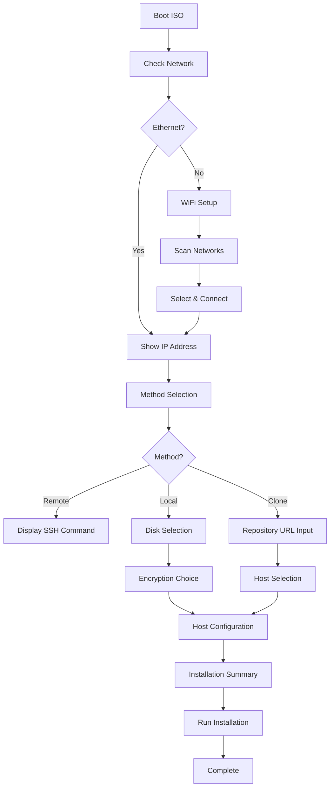

# TUI Installer Guide

This guide documents the Keystone TUI (Terminal User Interface) installer workflow, testing procedures, and troubleshooting.

## Overview

The Keystone TUI installer provides an interactive installation experience for NixOS with the Keystone framework. It automates:

1. **Network Configuration** - Ethernet or WiFi setup
2. **Installation Method Selection** - Remote (nixos-anywhere), Local, or Clone from repository
3. **Disk Configuration** - Partitioning with encryption options
4. **System Configuration** - Hostname, user, and system type (server/client)
5. **NixOS Installation** - Automated installation with progress tracking

## Architecture

### Core Components

- **`packages/keystone-installer-ui/`** - TUI installer React/Ink application
  - `src/App.tsx` - Main UI component with state management
  - `src/network.ts` - Network detection and WiFi configuration
  - `src/disk.ts` - Disk detection and partitioning utilities
  - `src/config-generator.ts` - NixOS configuration generation
  - `src/installation.ts` - Installation orchestration
  - `src/types.ts` - TypeScript type definitions

- **`modules/iso-installer.nix`** - ISO configuration that includes the TUI installer
  - Configures systemd service to auto-start TUI on TTY1
  - Includes necessary tools (disko, ZFS, cryptsetup, TPM2, etc.)
  - Sets up NetworkManager for WiFi support

### Installation Flow



## Module Configuration

The installer generates NixOS configurations that properly use Keystone modules:

### Server Configuration

For `systemType = 'server'`:
- Imports: `keystone.nixosModules.operating-system`
- User configuration: `keystone.os.users.<username>` with terminal enabled
- No desktop environment

### Client Configuration

For `systemType = 'client'`:
- Imports: `keystone.nixosModules.operating-system` + `keystone.nixosModules.desktop`
- User configuration: `keystone.os.users.<username>` with terminal + desktop enabled
- Hyprland desktop environment configured

### Generated Files

The installer creates:
1. **`flake.nix`** - Main flake with inputs (nixpkgs, keystone, home-manager)
2. **`hosts/<hostname>/default.nix`** - Host configuration with user setup
3. **`hosts/<hostname>/disk-config.nix`** - Disko configuration (NixOS module format)
4. **`hosts/<hostname>/disko-standalone.nix`** - Standalone disko config for CLI
5. **`hosts/<hostname>/hardware-configuration.nix`** - Auto-generated hardware config

## Building the Installer

```bash
# Build the TUI installer package
nix build .#keystone-installer-ui

# Build the ISO with the installer included
make build-iso

# Or with SSH keys for remote access
make build-iso-ssh
```

## Testing the Installer

### Local Development Testing

Test the TUI without real disk operations:

```bash
cd packages/keystone-installer-ui

# Install dependencies
npm install

# Run in development mode (DEV_MODE enabled)
npm run dev

# Or run the built package in dev mode
nix build .#keystone-installer-ui
DEV_MODE=1 result/bin/keystone-installer
```

In DEV_MODE:
- No actual disk partitioning or formatting
- Uses `/tmp/keystone-dev` for temporary files
- Simulates installation steps with delays
- Safe to run on development machines

### ISO Testing

Test the full installation flow in a VM:

```bash
# Build the ISO
make build-iso

# Create a test VM (see bin/virtual-machine for details)
./bin/virtual-machine --name tui-test --iso vms/keystone-installer.iso --start

# Connect to VM console
virsh console tui-test

# Or use graphical display
remote-viewer $(virsh domdisplay tui-test)
```

The installer will auto-start on TTY1 in the VM.

## Common Issues and Solutions

### Issue 1: Module Configuration Error

**Symptom**: Error during nixos-install about missing module

**Cause**: Incorrect module name in generated flake.nix

**Solution**: The fix in this PR corrects the module references:
- Server systems use `keystone.nixosModules.operating-system`
- Client systems use both `operating-system` and `desktop` modules

### Issue 2: User Configuration Error

**Symptom**: Error about undefined `keystone.os.users` option

**Cause**: Not importing the operating-system module

**Solution**: Ensure flake.nix imports `keystone.nixosModules.operating-system` which provides the `keystone.os.*` options

### Issue 3: WiFi Not Working in Installer

**Symptom**: No WiFi networks found or cannot connect

**Troubleshooting**:
```bash
# Check if wireless interface is detected
nmcli device status

# Enable WiFi radio if disabled
nmcli radio wifi on

# Manually scan for networks
nmcli device wifi rescan
nmcli device wifi list

# Check NetworkManager service
systemctl status NetworkManager
journalctl -u NetworkManager -f
```

### Issue 4: Disko Fails to Partition

**Symptom**: Disko command fails during installation

**Troubleshooting**:
```bash
# Check if disk is busy
lsblk
mount | grep /dev/nvme0n1  # Replace with your disk

# Unmount all partitions
umount /dev/nvme0n1p*

# Check for existing ZFS pool
zpool status
zpool export rpool  # If pool exists

# Verify disk is writeable
hdparm -I /dev/nvme0n1
```

### Issue 5: Installation Hangs

**Symptom**: Installation progress stops or hangs

**Troubleshooting**:
```bash
# Check installation log
tail -f /tmp/keystone-install.log

# Switch to another TTY (Ctrl+Alt+F2)
# Check disk usage
df -h

# Check nixos-install process
ps aux | grep nixos-install

# Check network connectivity (for package downloads)
ping -c 3 cache.nixos.org
```

## Manual Installation Alternative

If the TUI installer fails, you can perform a manual installation:

```bash
# 1. Network setup
nmcli device wifi connect "SSID" password "password"

# 2. Partition disk with disko
# Generate or write a disko config, then:
disko --mode disko /path/to/disko-config.nix

# 3. Generate configuration
nixos-generate-config --root /mnt

# 4. Edit configuration
vim /mnt/etc/nixos/configuration.nix

# 5. Install
nixos-install --root /mnt

# 6. Set passwords
nixos-enter --root /mnt
passwd <username>
exit

# 7. Reboot
reboot
```

## Development Workflow

When working on the TUI installer:

1. **Make changes** to TypeScript files in `packages/keystone-installer-ui/src/`

2. **Test locally** with dev mode:
   ```bash
   cd packages/keystone-installer-ui
   npm run dev
   ```

3. **Build the package**:
   ```bash
   nix build .#keystone-installer-ui
   ```

4. **Update hash if dependencies changed**:
   - If you modify `package.json` or `package-lock.json`
   - Build will fail with expected hash in error message
   - Update `npmDepsHash` in `default.nix`

5. **Test in ISO**:
   ```bash
   make build-iso
   # Test in VM as described above
   ```

6. **Run formatter** before committing:
   ```bash
   nix fmt
   ```

## Logging and Debugging

### Installation Logs

All installation operations are logged to `/tmp/keystone-install.log`:

```bash
# Watch log in real-time
tail -f /tmp/keystone-install.log

# Search for errors
grep -i error /tmp/keystone-install.log
grep -i fail /tmp/keystone-install.log
```

### Systemd Service Logs

The TUI installer runs as a systemd service:

```bash
# Check service status
systemctl status keystone-installer

# View service logs
journalctl -u keystone-installer -f

# Restart service manually
systemctl restart keystone-installer
```

### Network Debugging

```bash
# Check network interfaces
ip addr show
ip link show

# Check routing
ip route show

# Check DNS
resolvectl status

# NetworkManager status
nmcli general status
nmcli connection show
```

## Security Considerations

1. **SSH Keys**: The installer ISO can be built with SSH keys for remote access
   - Use `make build-iso-ssh` with `~/.ssh/id_ed25519.pub`
   - Keys are embedded in the ISO for installation access only

2. **Passwords**: User passwords are set during installation
   - Transmitted securely within the installation environment
   - Hashed before storage in the installed system

3. **Encryption**: TPM2-based disk encryption is recommended
   - Automatic unlock on trusted boot configurations
   - Falls back to password prompt if TPM unavailable

4. **Network Security**: WiFi passwords are handled by NetworkManager
   - Not logged or stored in configuration files
   - Connection profiles saved encrypted by NetworkManager

## Contributing

When contributing to the TUI installer:

1. Follow the existing code style (TypeScript + React patterns)
2. Test in both dev mode and ISO mode
3. Update this documentation for significant changes
4. Add error handling for new features
5. Log operations for debugging purposes

## References

- [Ink Documentation](https://github.com/vadimdemedes/ink) - TUI framework
- [Disko Documentation](https://github.com/nix-community/disko) - Disk partitioning
- [NixOS Manual](https://nixos.org/manual/nixos/stable/) - NixOS installation
- [Keystone README](../README.md) - Project overview
