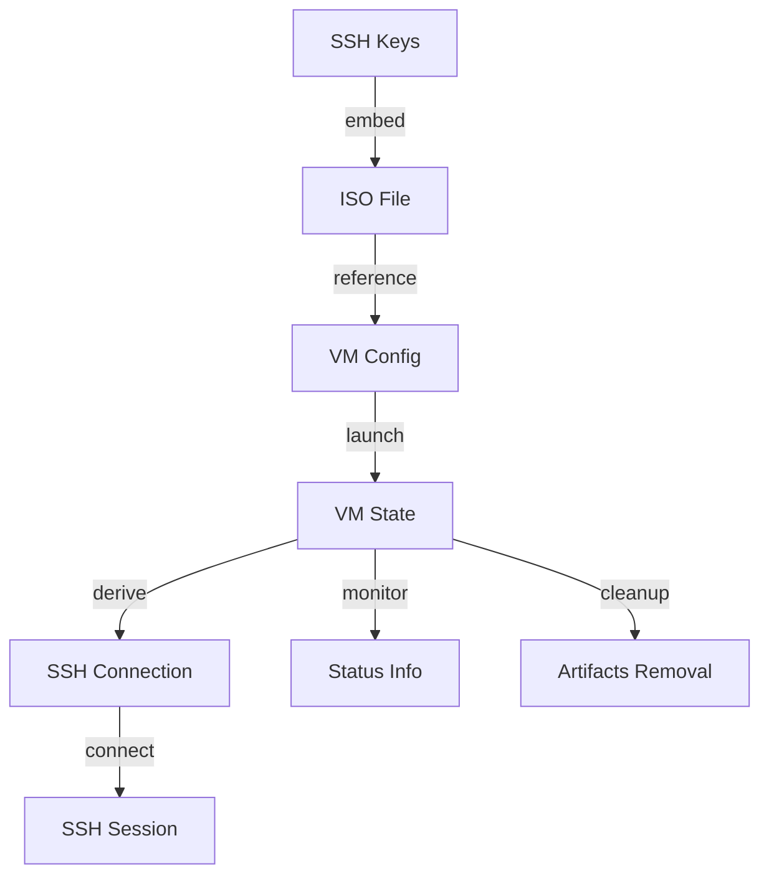
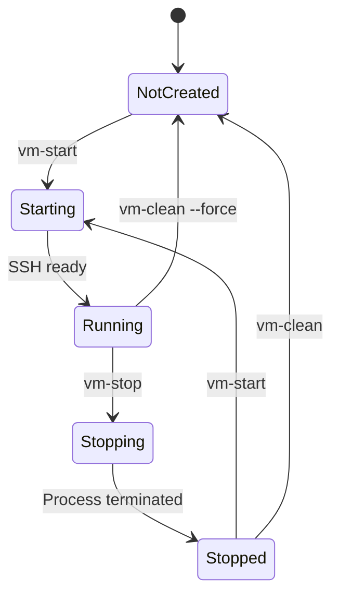

# Data Model: SSH-Enabled ISO with VM Testing

**Date**: 2025-10-17
**Feature**: SSH-Enabled ISO with VM Testing

## Overview

This feature primarily deals with VM state management and configuration data. The data model is file-based, using the filesystem as the source of truth for VM state.

## Core Entities

### 1. VM Configuration

**Entity**: `VMConfig`
**Storage**: `vms/server.conf` (quickemu configuration file)

**Attributes**:
- `guest_os`: Operating system type (e.g., "linux")
- `iso`: Path to ISO file relative to vms/ directory
- `disk_img`: Path to disk image relative to vms/ directory
- `disk_size`: Maximum disk size (e.g., "20G")
- `ram`: Memory allocation (e.g., "4G")
- `cpu_cores`: Number of CPU cores
- `display`: Display type (e.g., "gtk", "spice", "none")
- `ssh`: SSH port forwarding (e.g., "22220")

**Relationships**:
- References ISO file (1:1)
- Creates VM runtime state (1:1)

### 2. VM Runtime State

**Entity**: `VMState`
**Storage**: `vms/server/` directory

**Attributes**:
- `pid`: Process ID (from server.pid file)
- `ports`: Port mappings (from server.ports file)
- `disk`: QCOW2 disk image (server/disk.qcow2)
- `uefi_vars`: UEFI variables (server/OVMF_VARS.fd)
- `log`: Console output (server/server.log)
- `monitor_socket`: QEMU monitor socket path
- `serial_socket`: Serial console socket path

**States**:
- `not_created`: No VM artifacts exist
- `stopped`: VM artifacts exist but no process running
- `starting`: PID file exists, SSH not yet available
- `running`: PID valid and SSH port responding
- `stopping`: Shutdown signal sent, waiting for termination

**Relationships**:
- Created by VM configuration (1:1)
- Associated with SSH connection info (1:1)

### 3. ISO Build Configuration

**Entity**: `ISOConfig`
**Storage**: Command-line arguments and temporary files

**Attributes**:
- `ssh_keys`: Array of SSH public keys
- `output_path`: Location of generated ISO
- `nixos_modules`: List of NixOS modules to include

**Relationships**:
- Produces ISO file (1:1)
- Embedded in VM configuration reference (N:1)

### 4. SSH Connection Info

**Entity**: `SSHConnection`
**Storage**: Derived from VM state and configuration

**Attributes**:
- `hostname`: Target hostname (always "localhost" for VMs)
- `port`: SSH port (from VM config/state)
- `username`: SSH user (always "root" for installer)
- `key_path`: Path to private key (derived from public key used)
- `command`: Complete SSH command string

**Relationships**:
- Derived from VM state (1:1)
- References SSH keys used in ISO (N:M)

## Data Flow



## File Structure Mapping

```
vms/
├── server.conf              # VMConfig entity
├── keystone-installer.iso   # ISO file (created by ISOConfig)
└── server/                  # VMState entity container
    ├── disk.qcow2          # Persistent disk storage
    ├── OVMF_VARS.fd        # UEFI state
    ├── server.pid          # Process ID (state indicator)
    ├── server.ports        # Port mappings
    ├── server.log          # Console output
    ├── server-monitor.socket # Control channel
    └── server-serial.socket  # Debug channel
```

## State Transitions

### VM Lifecycle States



### State Detection Logic

1. **NotCreated**: No `vms/server/` directory or empty directory
2. **Stopped**: `server.pid` missing or PID not running
3. **Starting**: PID valid but SSH port not responding
4. **Running**: PID valid AND SSH port responding
5. **Stopping**: Shutdown command issued, waiting for PID to disappear

## Data Validation Rules

### VM Configuration
- `iso` must reference existing file in `vms/` directory
- `ssh` port must be valid (1024-65535) and not system reserved
- `disk_size` must be valid QEMU size format (e.g., "20G", "500M")
- `ram` must not exceed host available memory

### VM State
- PID must reference running qemu-system process
- Disk image must be valid QCOW2 format
- Port mappings must match configuration

### SSH Keys
- Must be valid OpenSSH public key format
- Must start with ssh-rsa, ssh-ed25519, or ecdsa-sha2
- Must not be empty or malformed

## Concurrency Considerations

### Single VM Instance
- Only one VM instance supported at a time
- Scripts use lock files to prevent concurrent operations
- State checks are atomic (PID file read)

### Operation Serialization
- Start/stop operations are mutually exclusive
- Status checks can run in parallel with other operations
- Clean operation requires exclusive access

## Error Conditions

### Missing Dependencies
- quickemu not installed
- QEMU/KVM not available
- Required directories not writable

### State Conflicts
- VM already running when start requested
- VM not running when stop requested
- Port already in use by another process

### Resource Issues
- Insufficient disk space for VM
- Insufficient memory for VM
- ISO file missing or corrupted

## Data Persistence

### Persistent Data
- VM disk image (survives stop/start)
- UEFI variables (survives stop/start)
- VM configuration file

### Ephemeral Data
- Process ID (recreated each start)
- Port mappings (recreated from config)
- Console logs (can be cleared)
- Socket files (recreated each start)

### Cleanup Scope
- `vm-clean`: Removes all VM state files
- `vm-clean --preserve-disk`: Keeps disk image only
- Manual cleanup: Direct file deletion

## Security Model

### Access Control
- VM files owned by user running scripts
- SSH keys never written to VM state directory
- Private keys never handled by scripts

### Network Isolation
- SSH port only on localhost by default
- No external network access without explicit config
- VM network isolated from host by default

## Future Extensibility

### Potential Enhancements
- Multiple VM support (server, client, etc.)
- VM snapshots for quick reset
- Cloud-init configuration injection
- Network configuration management
- Shared folders between host and VM

### Data Model Extensions
- VM template library
- SSH key registry
- Test scenario definitions
- Performance metrics collection