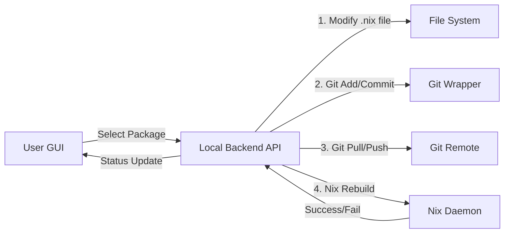

# Research: GUI-Driven Package Management with Git Automation for NixOS

This document explores strategies for modifying the Keystone "Nix Users Form GUI" (likely a web or local GUI interface) to allow users to install/remove packages and have the system automatically handle the underlying Git operations (commit, pull, push) and NixOS rebuilds.

## 1. Architectural Overview

The goal is to abstract the `Edit Config -> Git Commit -> Git Push -> NixOS Rebuild` loop into a simple "Install/Uninstall" button click.



## 2. Configuration & Setup

### Repository Synchronization
- **Requirement**: The user **must** explicitly specify a target Git repository URI (e.g., `git@github.com:user/nix-config.git`) during the initial setup of the GUI tool.
- **Storage**: This configuration should be stored in `~/.config/keystone/settings.json` or similar.
- **Validation**: The system must verify access (SSH keys/Auth token) to this repository before allowing any operations.

## 3. Package Management Logic

### Searching Packages
- **Source**: The GUI needs a searchable index of packages.
- **Implementation**:
    - Use the `nixos-search` API or a local cache of `packages.json` generated from `nix-env -qa --json`.
    - Use `nix search` command (slower) or a dedicated indexer service.

### Modifying Configuration
- **Challenge**: Programmatically editing `.nix` files without breaking comments or formatting.
- **Approaches**:
    - **Structured Imports**: Maintain a separate `gui-packages.nix` or JSON/TOML file that is imported by the main configuration. The GUI edits this structured data file, which is easier to parse and modify programmatically than arbitrary Nix code.

## 4. Git Automation Strategy

The system must act as a Git agent, treating version control as a transactional database.

### Semantic Commits
All automated commits **must** follow the [Conventional Commits](https://www.conventionalcommits.org/) specification (Semantic Commits) to allow for easy parsing of history and automated changelog generation.

**Format**: `<type>(<scope>): <description>`

**Examples**:
- Install: `feat(pkg): install firefox`
- Uninstall: `feat(pkg): remove vscode`
- Update: `chore(pkg): update system flake.lock`
- Revert: `revert(pkg): uninstall broken-package`

### Metadata Tracking (Git Notes & Trailers)
To distinguish between manual user edits and GUI-driven actions, and to store rich metadata without cluttering the subject line, the system will use **Git Trailers** or **Git Notes**.

**Metadata to track:**
- `Keystone-Managed: true`
- `Keystone-User-ID: <uid>`
- `Keystone-Action-ID: <uuid>`
- `Timestamp: <iso-8601>`
- `Source-Machine: <hostname>`

**Implementation via Commit Body (Trailers)**:
```text
feat(pkg): install firefox

Added via Keystone GUI.

Keystone-Managed: true
Keystone-Version: 1.2.0
Action-ID: 550e8400-e29b-41d4-a716-446655440000
```

### The "Auto-Commit" Workflow
1.  **Safety Check**: Ensure the working directory is clean or only has GUI-managed changes.
2.  **Pull First**: Always `git pull --rebase` before making changes to minimize conflicts.
3.  **Modify File**: Add/remove the package name.
4.  **Commit**: Create a semantic commit with metadata trailers.
5.  **Push**: Push changes to the specified remote repository.

### Handling Conflicts
- **Strategy**: Since this is a "managed" file, conflicts should be rare if the user doesn't manually edit the specific GUI-managed list.
- **Resolution**:
    - If a conflict occurs during pull, the GUI should abort and notify the user.

## 5. NixOS Rebuild Integration

After the configuration is updated and version-controlled:
1.  Trigger `nixos-rebuild switch --flake .#<host>`.
2.  Stream logs to the GUI to show progress.
3.  **Rollback**: If the rebuild fails, the system should:
    - Revert the Git commit.
    - Restore the previous configuration.
    - Notify the user of the failure reason.

## 6. Proposed Implementation Steps

1.  **Backend Service**: Create a local service that exposes endpoints for package operations.
2.  **Git Integration**: Implement the semantic commit and trailer logic.
3.  **Repo Config**: Add the initial setup flow for defining the sync repo.
4.  **Frontend**: Build the UI to search/install/remove and visualize the git-sync status.

## 7. Risks and Mitigations

| Risk | Mitigation |
| :--- | :--- |
| **Concurrent Edits** | File locking; checking git status before writes. |
| **Broken Config** | Validate syntax (`nix instanciate --parse`) before committing. |
| **Network Failure** | Queue git pushes for later; allow local operation. |
| **Authentication** | Check for valid SSH/Git credentials on startup. |