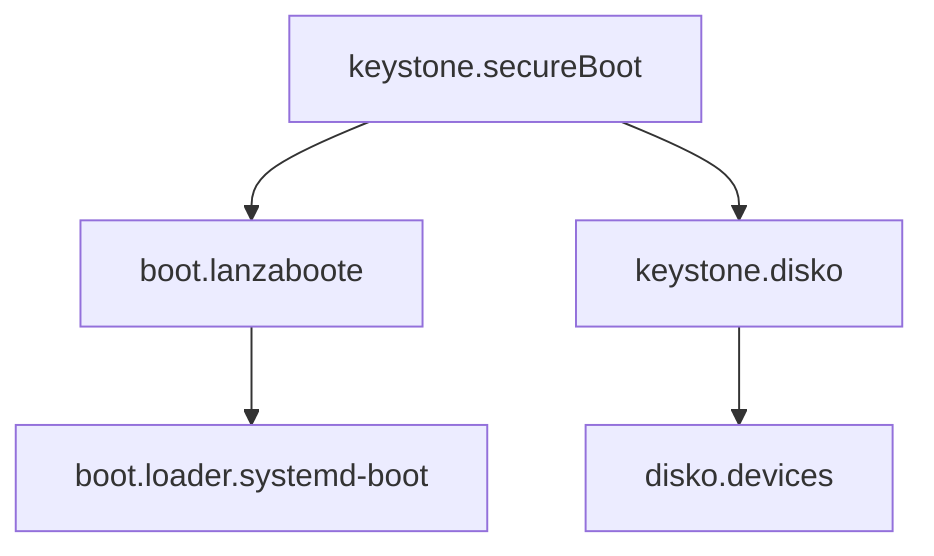

# Data Model: Secure Boot Integration

## Module Structure

### keystone.secureBoot

Primary NixOS module for Secure Boot configuration.

**Options**:
```nix
{
  enable = mkEnableOption "Secure Boot with lanzaboote";

  includeMS = mkOption {
    type = types.bool;
    default = false;
    description = "Include Microsoft certificates (for dual-boot or hardware compatibility)";
  };

  autoEnroll = mkOption {
    type = types.bool;
    default = true;
    description = "Automatically enroll keys when in Setup Mode";
  };

  pkiBundle = mkOption {
    type = types.str;
    default = "/var/lib/sbctl";
    description = "Path to PKI bundle directory";
  };
}
```

**State Transitions**:
- Disabled → Enabled: Triggers lanzaboote activation
- Setup Mode → User Mode: One-way transition after enrollment
- Keys Absent → Keys Present: During disko hook execution

### Disko Hook Configuration

**Hook Data Flow**:
```
Input: UEFI Setup Mode
  ↓
Check Setup Mode Status
  ↓
Generate Keys (PK, KEK, db)
  ↓
Write to /mnt/var/lib/sbctl/keys
  ↓
Enroll Keys in Firmware
  ↓
Output: UEFI User Mode + Keys Ready
```

**File Structure**:
```
/var/lib/sbctl/
├── keys/
│   ├── PK/
│   │   ├── PK.key
│   │   └── PK.crt
│   ├── KEK/
│   │   ├── KEK.key
│   │   └── KEK.crt
│   └── db/
│       ├── db.key
│       └── db.crt
└── GUID  # Hardware-specific GUID for keys
```

### Integration Points

**Module Dependencies**:


**Configuration Flow**:
1. User enables `keystone.secureBoot.enable`
2. Module activates `boot.lanzaboote`
3. Disko hook generates keys during deployment
4. Lanzaboote signs bootloader with keys
5. System boots with Secure Boot enabled

## Error States

### RecoverableErrors

**SetupModeNotDetected**:
- Condition: Setup Mode = 0 but keys don't exist
- Recovery: Check if keys already enrolled
- Action: Skip enrollment, proceed with existing keys

**EnrollmentPartialFailure**:
- Condition: Some keys enrolled but not all
- Recovery: Log warning, continue deployment
- Action: May require manual intervention post-boot

### FatalErrors

**KeyGenerationFailed**:
- Condition: sbctl create-keys returns non-zero
- Recovery: None - deployment cannot continue
- Action: Abort deployment with clear error

**NoEFISupport**:
- Condition: /sys/firmware/efi not present
- Recovery: None - Secure Boot requires UEFI
- Action: Abort with compatibility error

## Validation Rules

### Pre-Deployment
- UEFI firmware must be accessible
- sbctl must be in installer environment
- Target disk must have ESP partition

### During Hook Execution
- Setup Mode should equal 1 (unless force-enrolled)
- /mnt must be mounted and writable
- PKI directory must not exist (unless force mode)

### Post-Deployment
- All key files must exist and be readable
- Lanzaboote must successfully sign bootloader
- bootctl status must show Secure Boot enabled

## Module Interactions

### With keystone.disko
- Adds postCreateHook to root filesystem
- Ensures keys generated before NixOS build
- Maintains separation of concerns

### With boot.lanzaboote
- Provides pkiBundle path
- Enables module conditionally
- Configures systemd-boot integration

### With keystone.server
- Automatically included when server enabled
- No additional configuration required
- Transparent to end user

## Configuration Examples

### Minimal Configuration
```nix
{
  keystone.secureBoot.enable = true;
}
```

### With Microsoft Certificates
```nix
{
  keystone.secureBoot = {
    enable = true;
    includeMS = true;  # For dual-boot scenarios
  };
}
```

### Manual Enrollment
```nix
{
  keystone.secureBoot = {
    enable = true;
    autoEnroll = false;  # Keys generated but not enrolled
  };
}
```